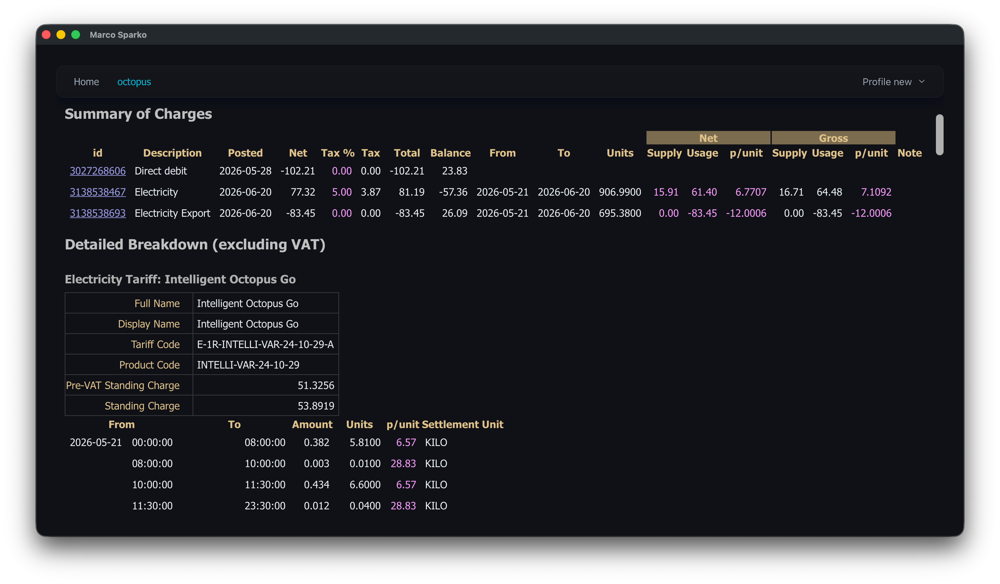
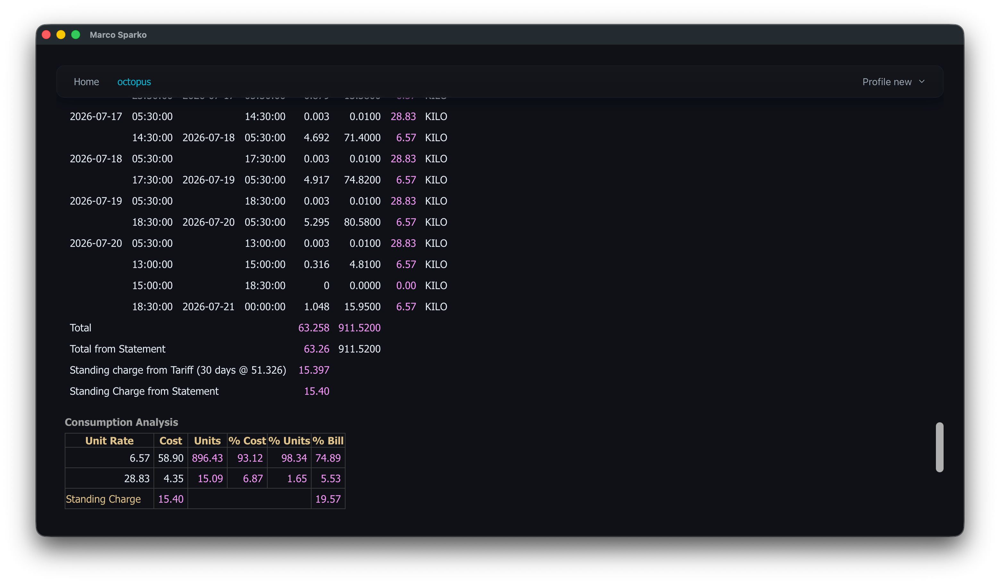
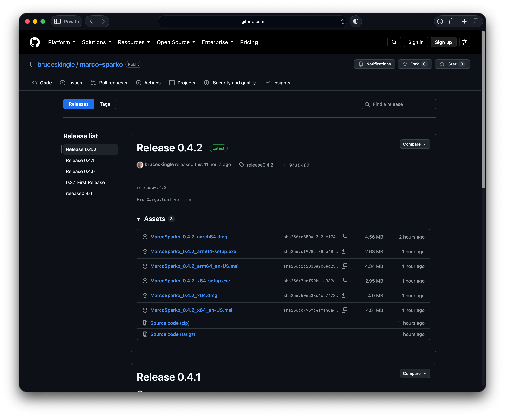

# marco-sparko
### The Energy Explorer

Marco Sparko is a desktop application for MacOS and Windows which provides a view of your Octopus Energy account.

The application is a platform with a module framework which is intended to support other services as well, but at the moment Octopus Energy is the only module.

# What Does it Do?

Using this application you can get a detailed view of your energy account statements with an analysis of the unit rates you are consuming.
In this screenshot you can see the summary lines from a statement more or less as they appear on the documents provided by the company.

Values in white text (e.g. , the Net value from the electricity import line) are from the Octopus API directly.

Values in magenta text (e.g. , the Tax% value from the same line) are derived (calculated by the application from data from the API or other derived values). In this case it is because the API provides the Net, Gross and tax amounts but does not specify the rate of tax applied so this is calculated from the amounts.

Values in red text (e.g. , not shown on this screenshot) are error values, generally ```Null``` means a value is null in the data returned from the API and ```None``` means that it is a derived value which depends upon a Null value elsewhere.

There then follows a detailed breakdown of each of those summary lines where the API provides more detail, including the Tariff being applied and the individual 30 minute charge periods amalgamated for each change of rate. The unit cost in pence is back calculated from the number of units and the charge and displayed along side. This shows that when an Intelligent Octopus Go smart charge session is triggered (as it was between 10:00 and 11:00 that day) that all consumption during that period is billed at the cheap rate.



After all the detailed line items there are some totals, including values calculated from the line items as well as taken from the summary record (which are the figures actually appearing on the bill) which demonstrates that everything lines up.

Finally the consumption analysis section shows us the total amounts per charge rate, I have solar and batteries and July has been very sunny so as you can see I have managed to keep my consumption almost entirely at the cheap rate.



I intend to continue expanding the scope of this but for the moment that's the main thing it provides.

# Current Status


This is a hobby project of mine, it is not supported, endorsed or approved by Octopus Energy or anyone else. I have no inside knowledge of the workings of Octopus or Kraken and this is all implemented against the publicly documented GraphQL API.

The application is written entirely in the [Rust programming language](https://rust-lang.org) and uses the
[Dioxus GUI Framework](https://dioxuslabs.com)

The source code is all available on GitHub and available under the MIT or Apache2.0 license at your choice, and there are pre-compiled binaries for Windows and MacOS in both ```x86``` (64bit intel processors) and ```aarch64/arm64``` (Apple Silicon/ARM64) processor families.

There is no export facility at the moment but all data received from the API is cached locally in the JSON format as it is received. This data is stored in plain files in a folder called ```.marco-sparko-cache``` in your home directory.

A verbose mode causes the app to print the individual GraphQL queries, variables and responses made by the application. This may be useful if you are
writing code which accesses the API.

There is some documentation which lists the queries I have observed the Octopus web application making which I used to understand which API
calls I needed to make and which may be useful to anyone who is attempting to call the API in their own code. I have also documented the process to see these queries from the Google Chrome web inspector. This is pretty standard practice for people developing web apps commercially but if this is something you have not seen before it might be useful to know.

I will endeavor to respond to any comments or questions (email: github at skingle.org), but please bear in mind that this is a hobby project.

# Installation
Navigate to [https://github.com/bruceskingle/marco-sparko/releases/](https://github.com/bruceskingle/marco-sparko/releases/) to find the
latest release: 



Look for the one with the  label, and then select the correct version for your computer. 

The ```.dmg``` files are for Mac OSX and the ```.exe``` and ```.msi``` ones are for Microsoft Windows. The ```.exe``` and ```.msi``` files are just different ways of installing, the detailed installation instructions show the ```setup.exe``` version so unless you have a preference for the ```.msi``` approach you should use that.

The ```x86``` files are for Intel based computers and the ```aarch64/arm64``` ones are for ARM CPUs, including "Apple Silicone" or Apple M1, M2 etc processors.

# Documentation
If you have just downloaded the app check out the [Getting Started](docs/gettingStarted/index.md) page. This includes detailed installation instructions for both MacOS and Windows.

The [Documentation Home](docs/index.md) is the starting point for access to all of the documentation.


Plugins provide access to various utilities and services, the following sections provide more detailed information about them:

[Octopus Energy](https://github.com/bruceskingle/marco-sparko/blob/main/docs/octopus/index.md)

License
=======

Licensed under either of

* Apache License, Version 2.0,
  (./LICENSE-APACHE or http://www.apache.org/licenses/LICENSE-2.0)
* MIT license (./LICENSE-MIT or http://opensource.org/licenses/MIT)
  at your option.

Contribution
------------

Unless you explicitly state otherwise, any contribution intentionally
submitted for inclusion in the work by you, as defined in the Apache-2.0
license, shall be dual licensed as above, without any additional terms or
conditions.
