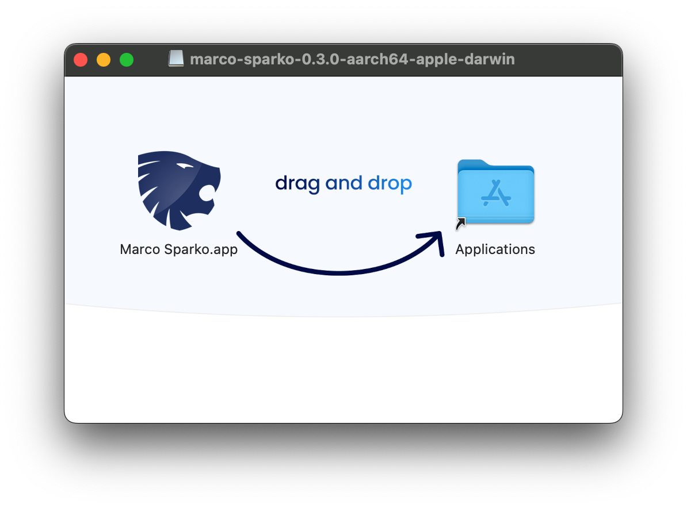

# marco-sparko
### The Energy Explorer

Marco Sparko is an application and a set of libraries to access the APIs of various energy service providers, written in the Rust programming language. As we install more and more smart energy devices in our homes it becomes more and more difficult to get an overall view of usage and to get the most out of the resources at our disposal.

This is a hobby project of mine, it is not supported, endorsed or approved by Octopus Energy, Tesla, Myenergi or anyone else.

The source code is all available on GitHub and available under the MIT or Apache2.0 license at your choice.

# Current Status
Although Marco Sparko is a module framework it currently has only one module, for the Octopus Energy API and it is therefore
currently a command line tool which is possibly useful to existing customers of Octopus Energy, which allows you to:

* Print a summary of all the bills on your account.
* Print the details of a bill, including the individual line items which make up the consumption charges.
  * (i.e. to see the individual periods for which you were charged each separate tariff, this information in not included in the statements generated by Octopus and is particularly interesting if you are on an Intelligent or Agile tariff and would like to see exactly when you are charged at the various different tariff rates.)
  * Including an analysis of what percentage of the total bill is made up of peak and off-peak consumption charges and standing charges.
* Keep a local copy of the displayed data, the results of the API queries which are received back from the server are cached locally.
* Optionally to print the individual GraphQL queries, variables and responses made by the application. This may be useful if you are
writing code which accesses the API.

There is some documentation which lists the queries I have observed the Octopus web application making which I used to understand which API
calls I needed to make and which may be useful to anyone who is attempting to call the API in their own code. I have also documented the process to see these queries from the Google Chrome web inspector. This is pretty standard practice for people developing web apps commercially but if this is something you have not seen before it might be useful to know.

I will endeavor to respond to any comments or questions (email: github at skingle.org), but please bear in mind that this is a hobby project.

# Examples

The ```bills``` command displays a summary list of all bills in the account:

The ```bill``` command displays a details report of the latest bill, or any single bill if a bill ID is provided:

The detail lines at the bottom of this screenshot show the individual line items which make up the consumption charges shown on the bill. In this case Intelligent Octopus Go smart charging sessions occur between 11:30 am and 4pm and then again starting at 10:30pm. The unit costs shown here are back calculated from the charge and the number of units, showing that the individual line items are charged at the traiff rates, (whereas the totals shown on the statement are a combination of charges at these different rates and the per unit cost shown there is the average rate).

# Installation
Navigate to [https://github.com/bruceskingle/marco-sparko/releases/](https://github.com/bruceskingle/marco-sparko/releases/) to find the
latest release: 


Look for the one with the  label, and then select the correct version for your computer. 

The ```apple-darwin``` files are for Mac OSX and the ```windows-msvc``` ones are for Microsoft Windows.

The ```x86_64``` files are for Intel based computers and the ```aarch64``` ones are for ARM CPUs, including "Apple Silicone" or Apple M1, M2 etc processors.

## Mac Installation
Marco Sparko for Mac is released as a disk image (.dmg) file. Click on the file name to download the image, then click on ```Downloads``` in the dock and click on the disk image file to mount it. A window like this will open:

Drag and drop the app into the Applications folder in this window. If you have a previous version installed you will see the following dialog:

Click on ```Replace``` and the app will be installed.

Since this app is not signed you will need to open a ```Terminal``` window and execute the following command to remove the file from quarantine:

```
xattr -d com.apple.quarantine /Applications/Marco\ Sparko.app
```

If you wish to execute the app from the command line directly or from a shell script, the full path to the executable is
```
/Applications/Marco\ Sparko.app/Contents/MacOS/marco-sparko 
```
## Windows Installation
Download the executable and place it in ny convenient folder.


# The Final Vision
I intend Marco Sparko to become a platform supporting plugins to access various APIs including:

* Octopus Energy
* Myenergi
* Tesla

To provide an integrated view of energy usage across all of those platforms. I envisage:

* A command line utility to allow me to pull down usage data from all services in a form which can be loaded into a spreadsheet for analysis.
* A GUI which can allow me to explore data across all platforms
* An embedded system running on a Raspberry Pi or similar small computer which can act as a home automation controller, as well as being able to access these APIs.

This would enable me to switch on discretionary loads (such as an electric immersion heater for hot water) when power is cheap or free, or when there is surplus solar generation.

I would like to make the plugins entirely independent of the core code base so that plugins could be developed independently of access to the core source code (although it's available as Open Source anyway)

# Documentation
The [Documentation Home](docs/index.md) is the starting point for access to all of the documentation.

If you have just downloaded the app check out the [Getting Started](docs/gettingStarted/index.md) page.

Plugins provide access to various utilities and services, the following sections provide more detailed information about them:

[Octopus Energy](https://github.com/bruceskingle/marco-sparko/blob/main/docs/octopus/index.md)

License
=======

Licensed under either of

* Apache License, Version 2.0,
  (./LICENSE-APACHE or http://www.apache.org/licenses/LICENSE-2.0)
* MIT license (./LICENSE-MIT or http://opensource.org/licenses/MIT)
  at your option.

Contribution
------------

Unless you explicitly state otherwise, any contribution intentionally
submitted for inclusion in the work by you, as defined in the Apache-2.0
license, shall be dual licensed as above, without any additional terms or
conditions.
