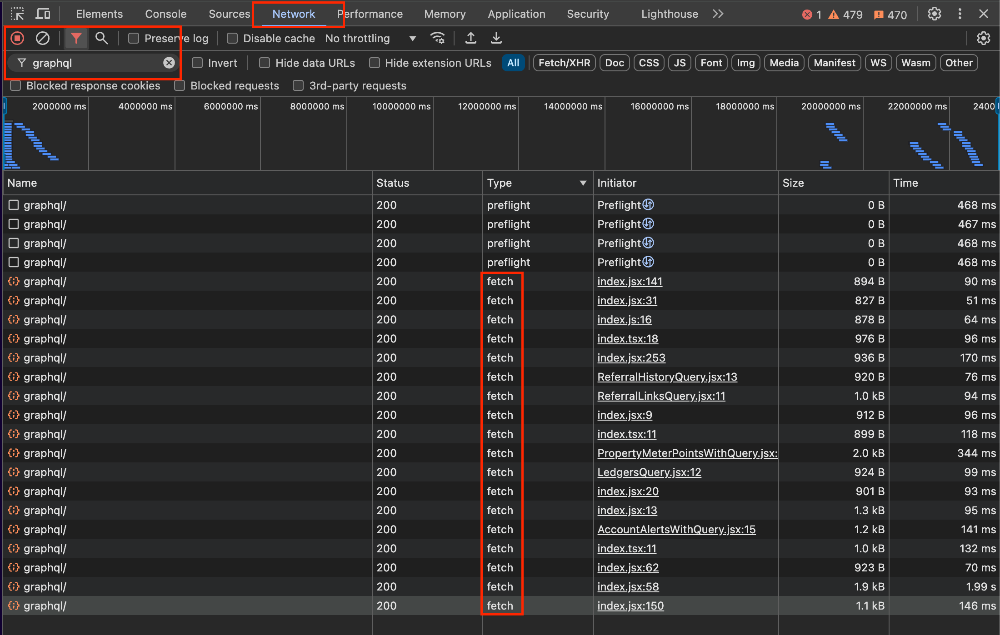

[< Documentation Home](index.md)

# Chrome Browser Inspector HowTo

Most web browsers provide developer tools which can allow you to inspect the individual requests a browser is making. I use a Mac and prefer Safari as my browser for general usage, but I prefer the web developer tools provided by Chrome. These instructions may help to get you going if this is all new to you, but if you have done this before and have a different way which works for you, then ignore this section.

In this example we will inspect the GraphQL queries made by the Octopus Energy Account Dashboard.

1. Download Chrome from https://www.google.com/chrome/
2. Watch this video which explains how to use the network panel of the inspector
    * https://developer.chrome.com/docs/devtools/network
3. Launch Chrome and open the inspector by right clicking and selecting `Inspect` from the context menu
4. Enter the Octopus dashboard URL in the URL bar at the top of the window
    * https://octopus.energy/dashboard
5. In the inspector activate the `Network` panel by clicking on the tab at the top
6. Activate the filter at the top left of the inspector if necessary by clicking on the funnel icon
7. Enter `graphql` in the filter, this will show only the graphql API requests
8. Ignore any `preflight` requests, we are only interested in the `fetch` requests. Click on the first one
9. The `Headers` tab shows the request result (which should be `200 OK`) and the request and response headers
10. The `Payload` tab shows the request body, which includes the GraphQL query and variables.
11. The `Response` tab shows the GraphQL response.

[The Octopus Energy Plugin >](octopus/index.md)