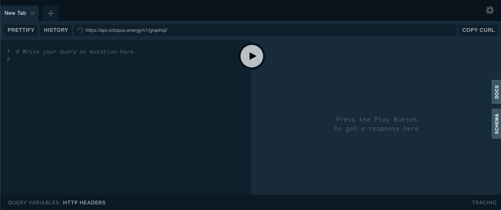
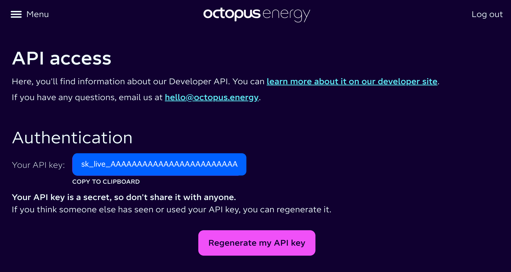

[< Documentation Home](index.md)

# GraphQL HowTo
[GraphQL](https://graphql.org) is a query language for APIs and a runtime for fulfilling those queries with your existing data. GraphQL provides a complete and understandable description of the data in your API, gives clients the power to ask for exactly what they need and nothing more, makes it easier to evolve APIs over time, and enables powerful developer tools.

## GraphQL Playground
[GraphQl Playground](https://www.apollographql.com/docs/apollo-server/v2/testing/graphql-playground/) is an interactive GUI which allows you to query Apollo based servers including the Octopus Energy GraphQL API.

You can try this if you navigate to https://api.octopus.energy/v1/graphql-playground, you should see this:



The main panel on the left, where it says `# Write your query or mutation here` is the query pane, you can paste in any GraphQL query or mutation here, for example:

```
mutation getMyToken($input: ObtainJSONWebTokenInput!) {
  obtainKrakenToken(input: $input) {
    payload
    token
  }
}
```

A `query` is a request for information from the server, a `mutation` is a request to change something on the server which may also return data in the same way as a query. This example mutation is a request to return an authorization bearer token for the Octopus API, which is needed as an HTTP Header for more or less every other request you might make.

The first line contains either the word `query` or `mutation` followed by a label for the request, in this case `getMyToken`. You should use a different name for each different request you make, even if you are accessing the same underlying query or mutation. This will help you and the service provider to figure out which request different log entries relate to if things go wrong.

This is followed by the variables which will be provided to satisfy the parameters required for the query, in this case a variable called `$input` containing a value of type `ObtainJSONWebTokenInput`. The exclamation mark indicates that this parameter is required (must be provided).

You can see the definition of this type by clicking on the `SCHEMA` or `DOCS` tabs on the right hand side of the window.


The second line contains the name of the GraphQL query or mutation to be called (`obtainKrakenToken` in this case), this must be one of the values defined in the schema for this GraphQL service.

The body of the request lists the set of attributes offered by the selected query or mutation which should be returned, in this case we want the `payload` and `token` attributes. The set of valid attributes can be found in the schema and docs and the query editor has name completion which can also be helpful.

We now know that we need a variable called `$input` and we can enter this if we click on `QUERY VARIABLES` at the bottom and paste the following into the panel which opens below:
```
{
    "input": {
        "APIKey": "test"
    }
}
```

Now click the big play button in the centre and on the right hand side you should see a response similar to this:

```
{
  "errors": [
    {
      "message": "Invalid data.",
      "locations": [
        {
          "line": 2,
          "column": 3
        }
      ],
      "path": [
        "obtainKrakenToken"
      ],
      "extensions": {
        "errorType": "VALIDATION",
        "errorCode": "KT-CT-1139",
        "errorDescription": "Authentication failed.",
        "errorClass": "VALIDATION",
        "validationErrors": [
          {
            "message": "Authentication failed.",
            "inputPath": [
              "input",
              "apiKey"
            ]
          }
        ]
      }
    }
  ],
  "data": {
    "obtainKrakenToken": null
  }
}
```

As you can see, we got an error because the value `test` which we provided as the `APIKey` attribute of the input variable is not a valid API key. We can see the structure of the GraphQL response here, the top level `errors` attribute contains information about the problems the server detected in the request. 

The `data` element contains the returned data, in this case a single element containing the value of the requested `obtainKrakenToken` querey, which is `null`.

Further details about this structure can be found in the [Section 7.1 of the GraphQL Specification](https://spec.graphql.org/October2021/#sec-Response-Format).

If you are an Octopus Energy customer you can find your API Key by going to https://octopus.energy/dashboard/new/accounts/personal-details/api-access



If you click on the API key it will be copied to your clipboard, if you then replace the string `test` in the `QUERY VARIABLES` pane with your API key and press the play button again you will see a response similar to this:

```
{
  "data": {
    "obtainKrakenToken": {
      "payload": {
        "sub": "kraken|account-user:9999999",
        "gty": "API-KEY",
        "email": "you@your.domain",
        "tokenUse": "access",
        "iss": "https://api.octopus.energy/v1/graphql/",
        "iat": 1724155372,
        "exp": 1724158972,
        "origIat": 1724155372
      },
      "token": 
      "qwertyuiop1234567890qwertyuiop1234567890qwertyuiop1234567890qwertyuiop1234567890qwertyuiop12345678
      qwertyuiop1234567890qwertyuiop1234567890qwertyuiop1234567890qwertyuiop1234567890qwertyuiop123456789
      qwertyuiop1234567890qwertyuiop1234567890qwertyuiop1234567890qwertyuiop1234567890qwertyuiop123456789
      qwertyuiop1234567890qwertyuiop1234567890qwertyuiop1234567890qwertyuiop1234567890qwertyuiop123456789
      qwertyuiop1234567890qwertyuiop1234567890qwertyuiop1234567890qwertyuiop1234567890qwertyuiop123456789
      qwertyuiop1234567890qwertyuiop1234567890qwertyuiop1234567890qwertyuiop1234567890qwertyuiop123456789
      qwertyuiop1234567890qwertyuiop1234567890qwertyuiop1234567890qwertyuiop1234567890qwertyuiop123456789
      qwertyuiop1234567890qwertyuiop1234567890qwertyuiop1234567890qwertyuiop1234567890qwertyuiop123456789
      qwertyuiop1234567890qwertyuiop1234567890qwertyuiop1234567890qwertyuiop1234567890qwertyuiop123456789
      qwertyuiop1234567890qwertyuiop1234567890qwert"
    }
  }
}
```
This is a [JSON Web Token (JWT)](https://jwt.io/) which is a short lived bearer token (i.e. a token, possession of which is considered as proof of identity). Although this is a short lived token you should treat it as sensitive and not store it anywhere unnecessarily. If you paste the `token` value into the JWT website above you will see the contents and as you will see, the payload of the JWT is also provided in the GraphQL response as the `payload` attribute as a convenience.

I believe the jwt.io site is safe and does not copy the tokens pasted into it, but cannot guarantee this. Extreme caution should be used with other sites which offer similar functionality.

The `iat` attribute is the time when the token was issued, if you paste the value `1724155372` into https://www.epochconverter.com/ you will see that this is a Unix timestamp (starting from 1st January 1970) in seconds for Tuesday, 20 August 2024 12:02:52.

The `exp` attribute is the expiry time for the token, in this case `1724158972` or Tuesday, 20 August 2024 13:02:52, so we can see that the token is valid for a maximum of 1 hour.

If you are writing an application to call the API you will need to refresh the token each time before it expires. Using the graphql-playground you will need to repeat the process above and update the token as and when it expires.

Once you have a token, click on the `HTTP HEADERS` tab at the bottom left of the window and paste in this, replacing the token placeholder with the value you just received:

```
{
  "Authorization":	"qwertyuiop1234567890"
}
```

The method of authentication varies from API to API so the exact process will be different with other GraphQL servers, however the passing of the received token in the `Authorization` header of subsequent requests is a fairly standard approach.

[Chrome Browser Inspector HowTo >](ChromeInspector.md)