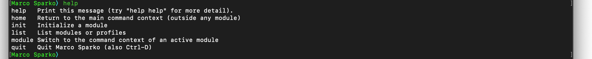
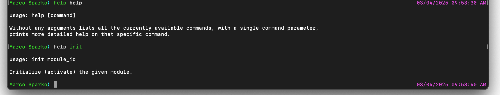
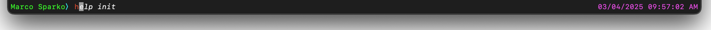
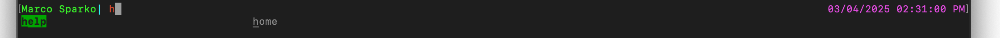

[< Documentation Home](../index.md)

# Getting Started

The first time you run Marco Sparko you will find yourself at the home command line. The ```Marco Sparko``` prompt indicates that this is the home command line. In addition to the home command line each module has its own command line and the prompt will then be the name of the module.

There are a few universal commands which work at any command line, the ```help``` command will display a list of all teh valid commands at the current command line:



For each command you will see the name of the command and a short one line description of what tht command does. You can also get more detailed information about a command (including the help command) by typing ```help <COMMAND>``` where <COMMAND> is the command you want more information about:



The universal commands are:

* help - Display information about other commands
* home - Switch to the Home command line
* module - Switch to the command line of the named module
* quit - Terminate the application (you can also type the End of File character ```Ctrl-D``` to do this)

The command line supports command history and tab completion, if you type the start of a command previously executed then you will see a possible completion offered in italics like this:



If you press the ```Right Arrow``` key then the command will be completed, you can then edit the command if necessary, and press ```Return``` to execute it. You can also use the ```Up Arrow``` and ```Down Arrow``` keys to scroll through the command history.

If you type a partial command and press the ```Tab``` key then you will be offered a menu of possible commands which begin with the given input:



[Initialize Octopus>](initOctopus.md)]