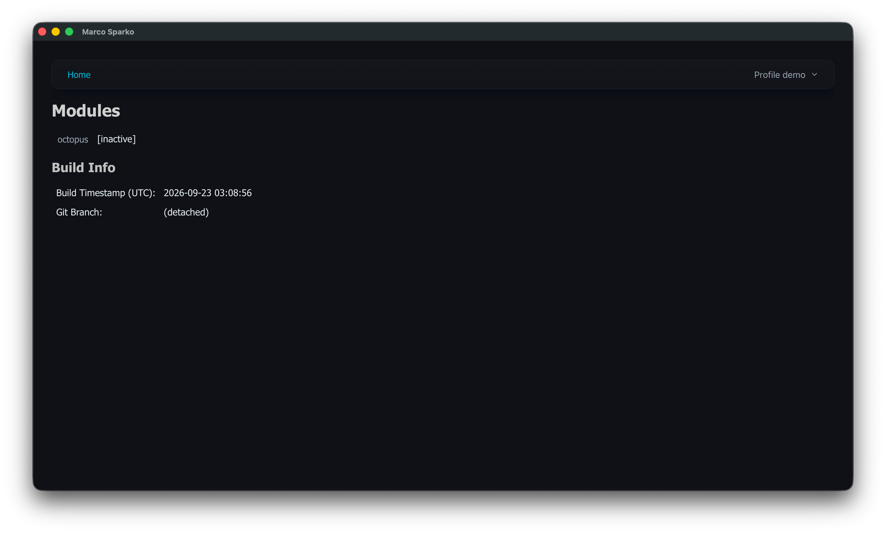

[< Documentation Home](../index.md)
# Installation
There are separate pages containing step by step instructions to install the application on [MacOS](osx/index,md) and [Windows](windows/index.md).

<b>NOTE that the release binaries are NOT SIGNED and additional steps are required on both platforms to complete the installation, please take a look at the instructions even if you are familiar with installing applications.

# Getting Started

The first time you run Marco Sparko you will see a window like this:




This is the ```Home``` screen which lists all the available Modules (there is ony Octopus at the moment) as well as displaying the timestamp when the release was created and the name of the Git branch it was built from. ```(detached)``` just means that this executable was built from a release tag in the source code repository which is normal for a formal release. You can ignore this information. Notice that the Octopus module shows as ```[inactive]``` because we have not logged in yet.

Clickable links in the user interface will highlight if you hover the mouse over them. In this case the ```Home``` item on the menu bar at the top (which brings you back to this page) and the names of modules in the list (just ```octopus``` at the moment) are clickable.

The first step is to rectify this.

[Initialize Octopus>](../octopus/initOctopus.md)]