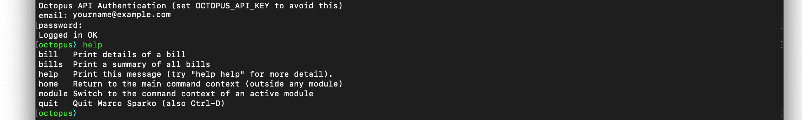

[< Getting Started](index.md)

# Initialize Octopus

To set up access to your Octopus Energy account enter the command

```
init octopus
```



When prompted, enter your email address and password for the Octopus Energy web site and app. If the email address and password are entered correctly you will see the message ```Logged in OK``` and the command line will switch to the Octopus command line. If you execute the help command you will see the Octopus module commands listed.

If you now quit the application and look at the file ```.marco-sparko``` in your home directory you will find the following content:

```
[
  {
    "name": "default",
    "modules": {
      "octopus": {
        "apiKey": "xx_xxxx_XXXXXXXXXXXXXXXXXXXXXXXX",
        "billingTimezone": "Europe/London"
      }
    }
  }
]
```
Note that this file is updated as the program exits so you need to quit the application to see this update. As you will see, the API Key for your Octopus Energy account has been stored. This allows the application to authenticate automatically next time, so you will never need to log in again, unless you reset your API Key.

IT is important to understand that this API Key allows access to your account in the same way that your email address and password does so you should never share this key with anyone else.

[< Getting Started](index.md)