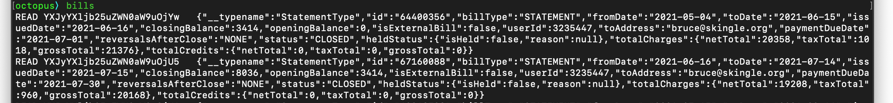
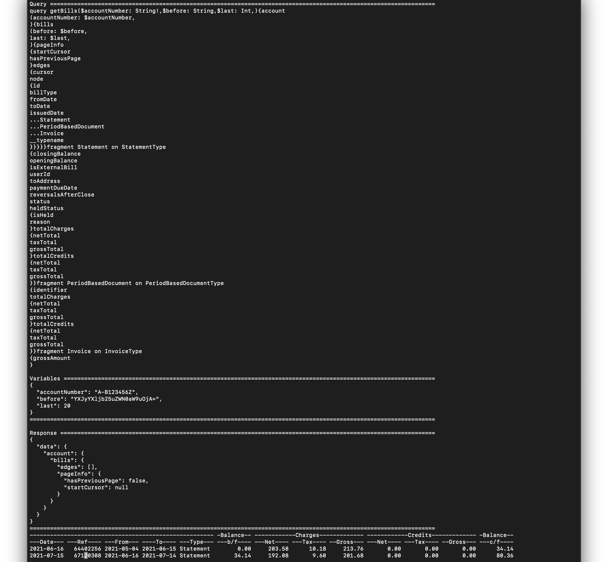

[< Initialize Octopus](initOctopus.md)

# Seeing GraphQL Queries and Responses with Verbose Mode

Verbose mode is enabled by passing the ```-v``` or ```--verbose``` flag when running Marco Sparko:

```
% /Applications/Marco\ Sparko.app/Contents/MacOS/marco-sparko -v
```
If we now execute the bills command we will see some examples of verbose output:



The ```bills``` command prints a list of all bills in your account, so the first thing it does is to read the cache for any records which
have been previously downloaded. In the screen shot above you can see the first few rows of the cache being loaded, each row represents a single record consisting of a cursor string and the JSON record as provided by the server.

Once the cache has been loaded we then make a request to the server to check for any new bills:



First we see the GraphQL Query which in this case is accessing the ```account``` root query. This is followed by the variables used with the query and finally we see the result from the server. In this case there are no new records and the result is empty (the ```edges: []``` array is where the data would be if there were new records to download).

Following this the normal response for the command can be seen.

[< Getting Started](index.md)