[< Getting Started](../index.md)
# Download the Release Binary

Navigate to [https://github.com/bruceskingle/marco-sparko/releases/](https://github.com/bruceskingle/marco-sparko/releases/) to find the
latest release: 


Look for the one with the  label, and then select the correct version for your computer, either
```MarcoSparko_0.4.2_x64-setup.exe``` for Intel based computers or ```MarcoSparko_0.4.2_arm64-setup.exe``` for ARM64 based computers (the version number ```0.4.2``` may be different of course).

The ```.msi``` files are just a different way of installing, these installation instructions show the ```setup.exe``` version so unless you have a preference for the ```.msi``` approach you should use that.

When you download the file you will see this warning like this:

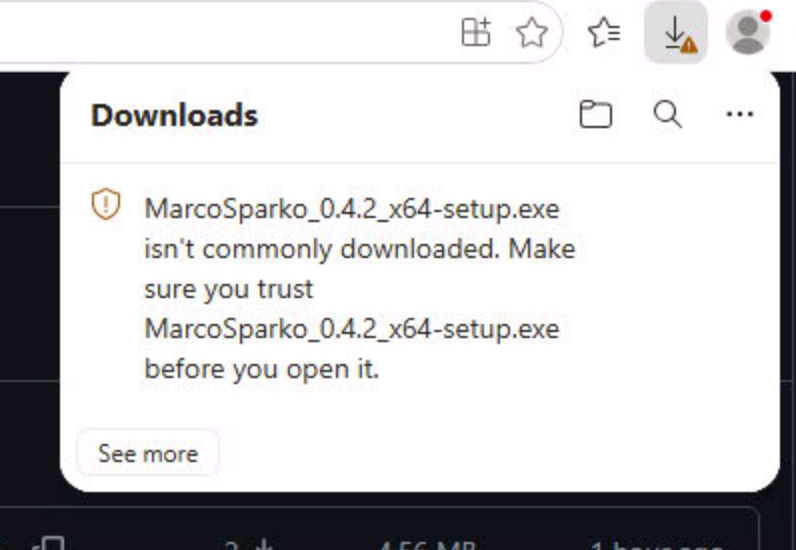

Hover over the download item and an ellipsis menu (```...```) will appear, click that and then select ```Keep``` from the pop up menu.

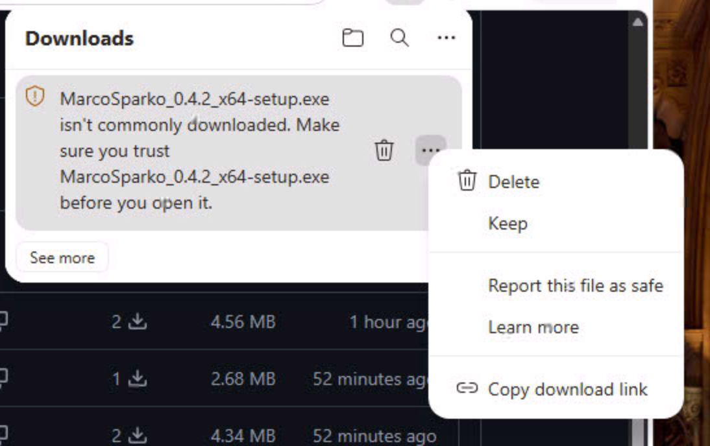

You will then see another warning like this, click on the down arrow (not the word ```Delete```) and select ```Keep Anyway```

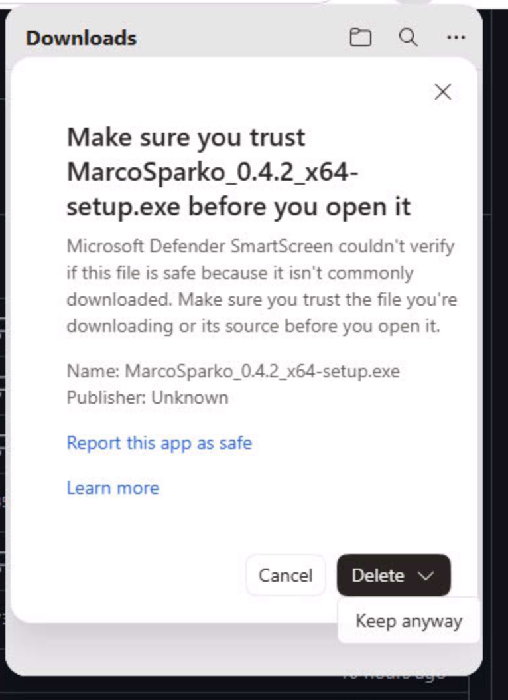

The download should then appear as normal and you should be able to click on ```Open file```

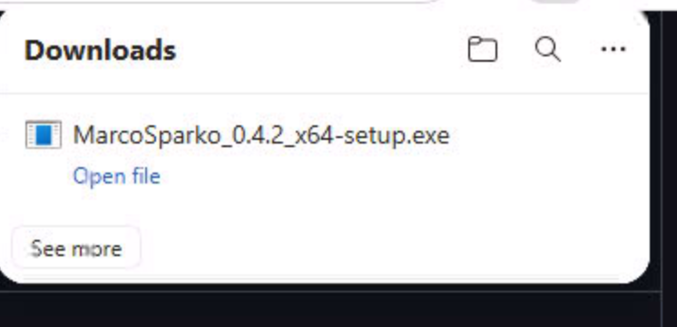

The installer will then start, click ```Next >```

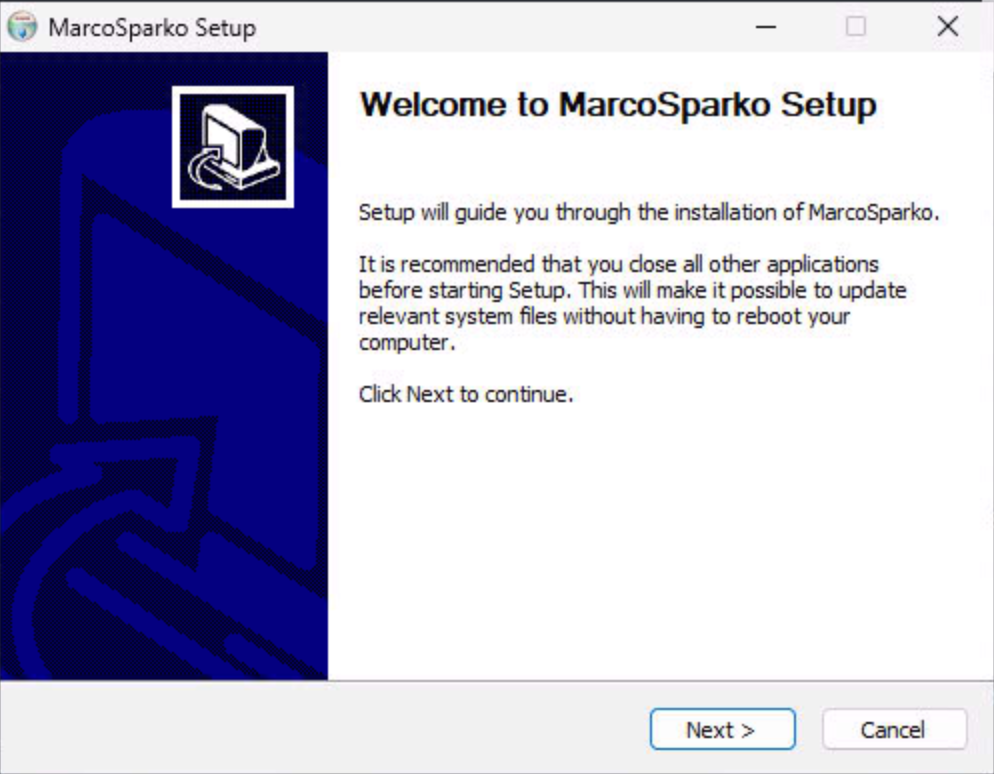

If you have already installed the application you will see this dialog, select ```Uninstall before installing``` and click ```Next>```

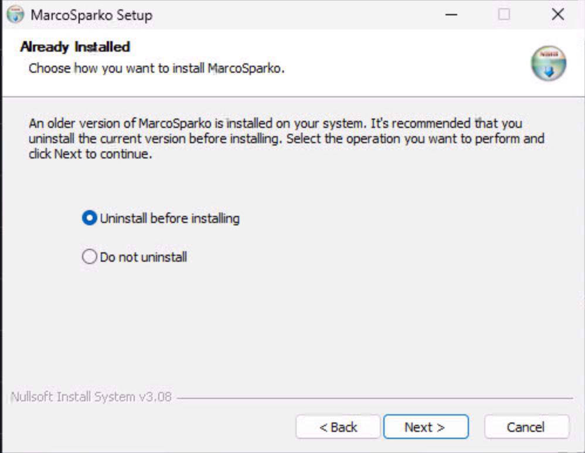

Leave ```Delete the application data``` unchecked and click ```Uninstall```.

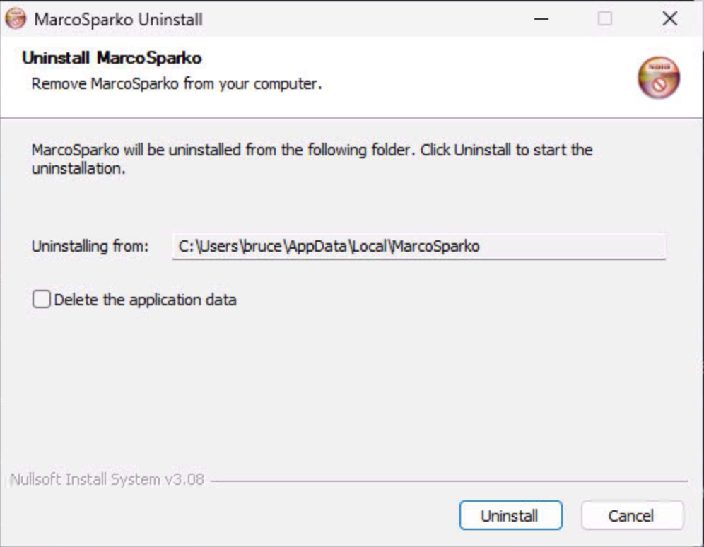

When the uninstall completes click ```Close```

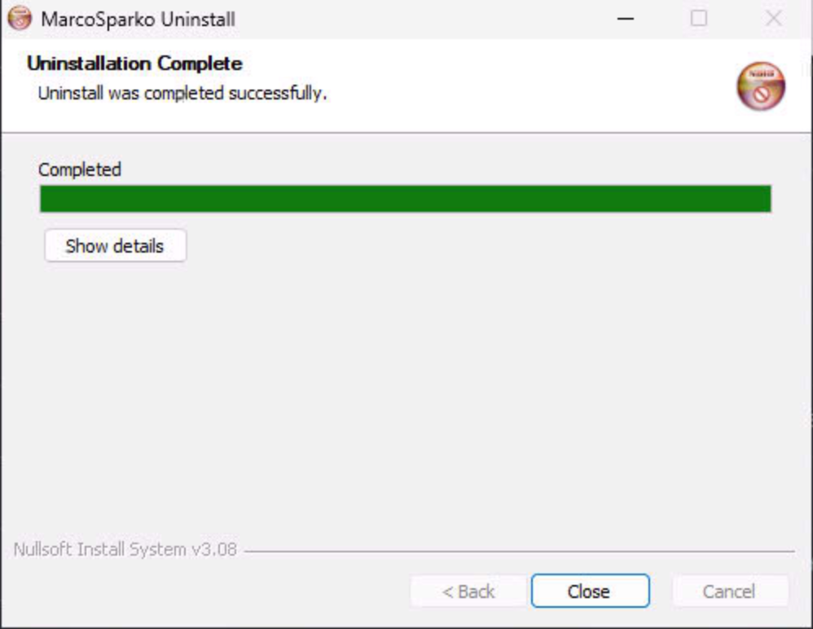

Then the installer will start, leave the ```Destination Folder``` as is and click ```Next>```

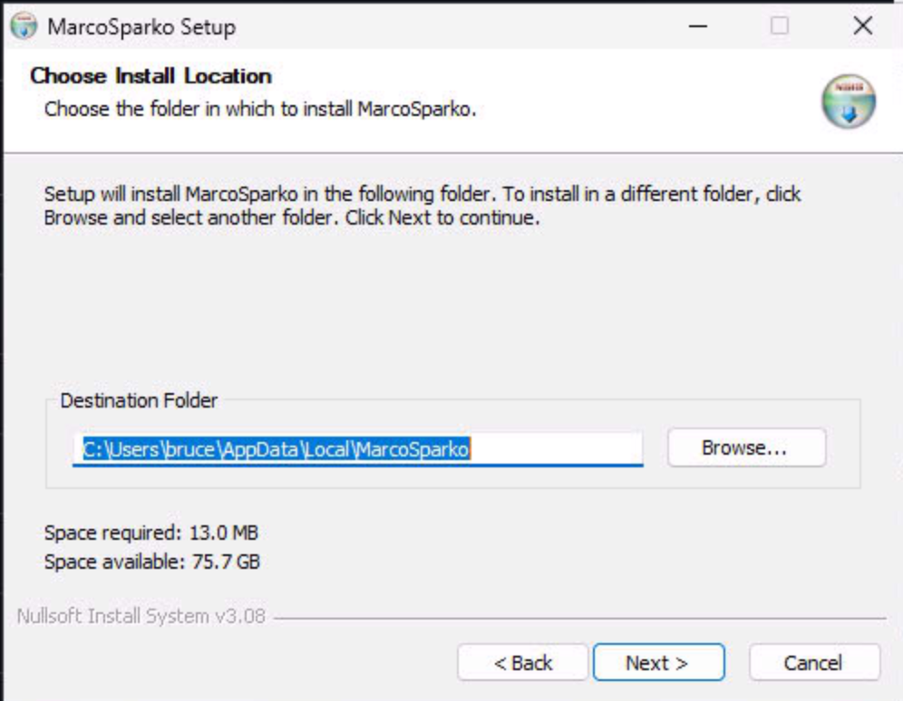

When the uninstall completes click ```Next```

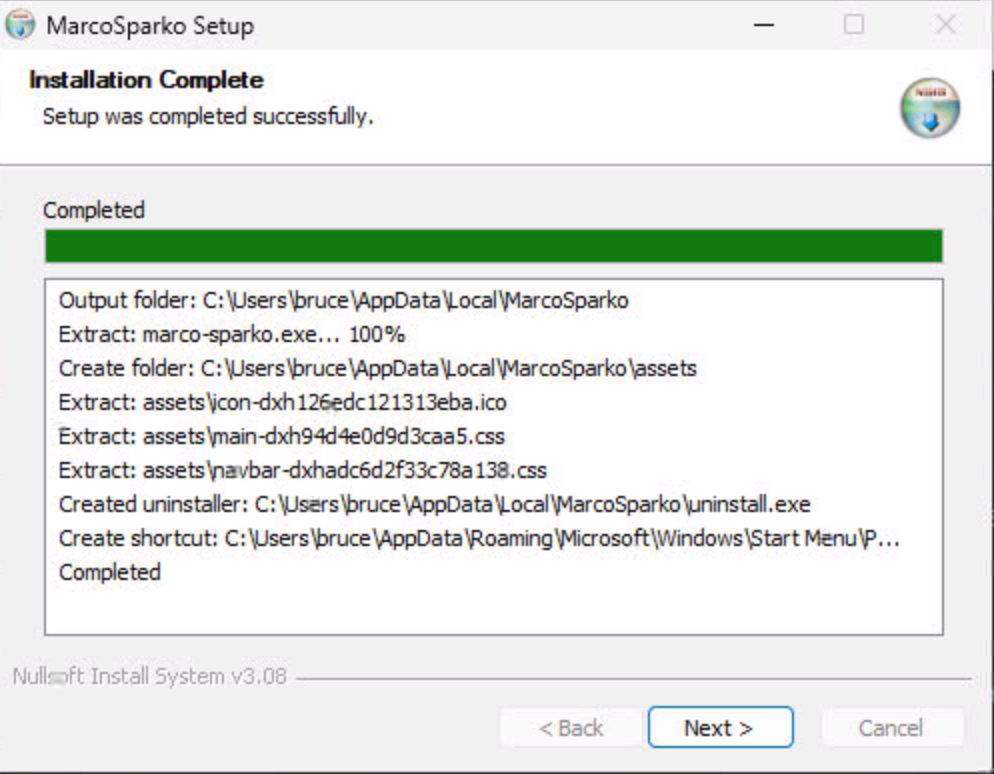

Finally click ```Finish```, the setup wizard will close and the application should start.

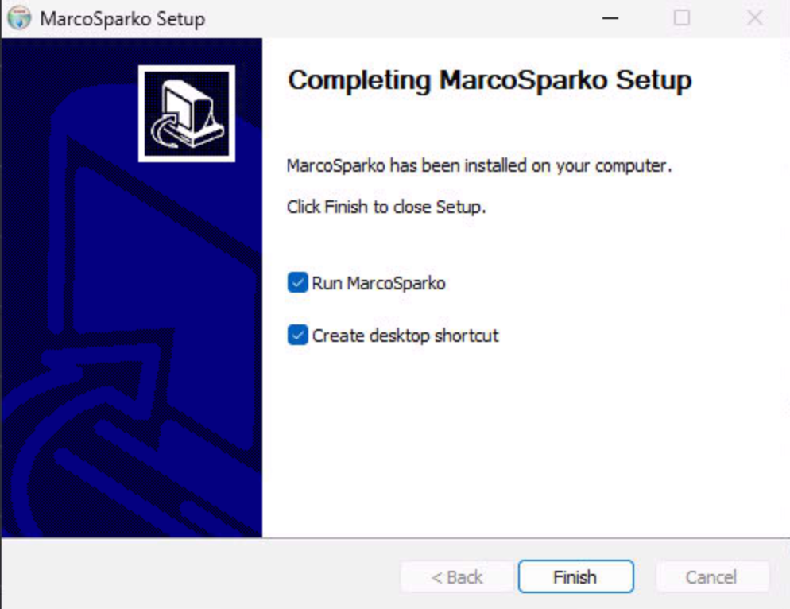

[Getting Started >](../index.md)