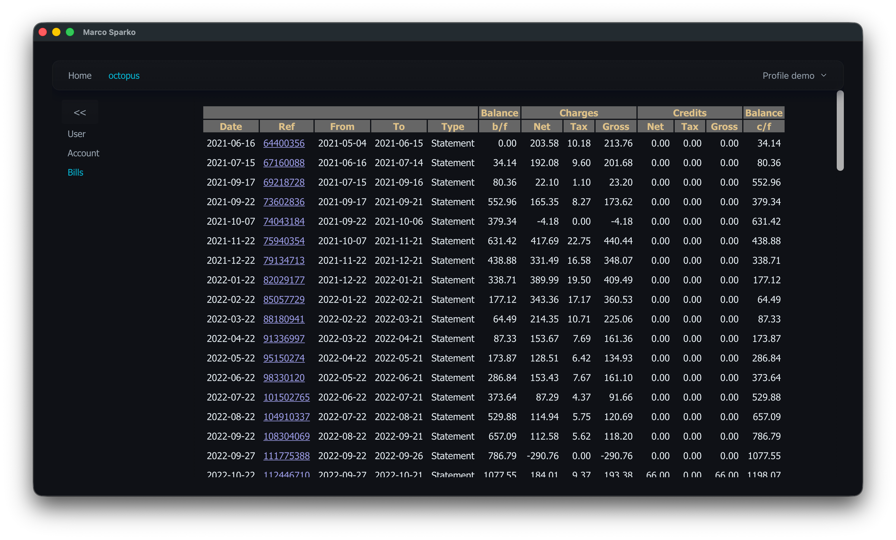
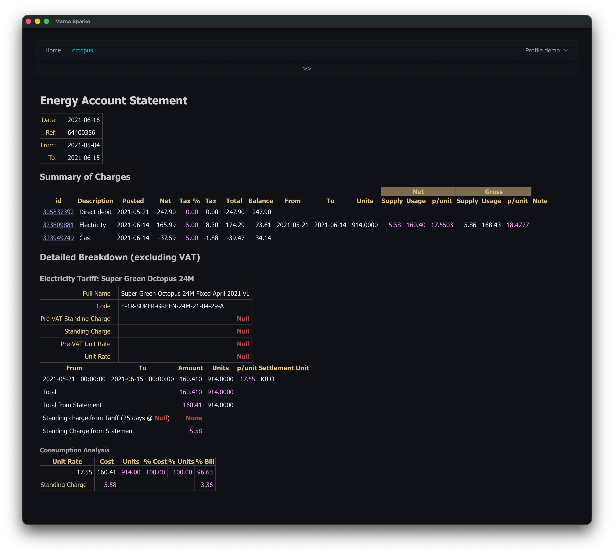
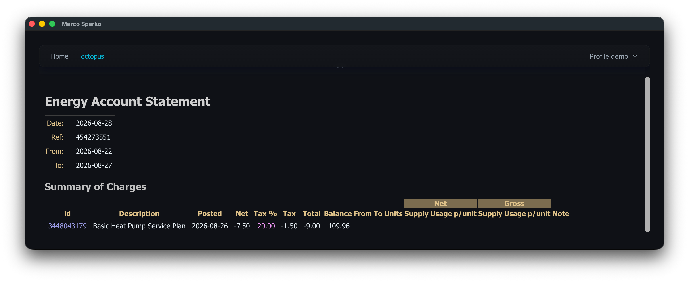
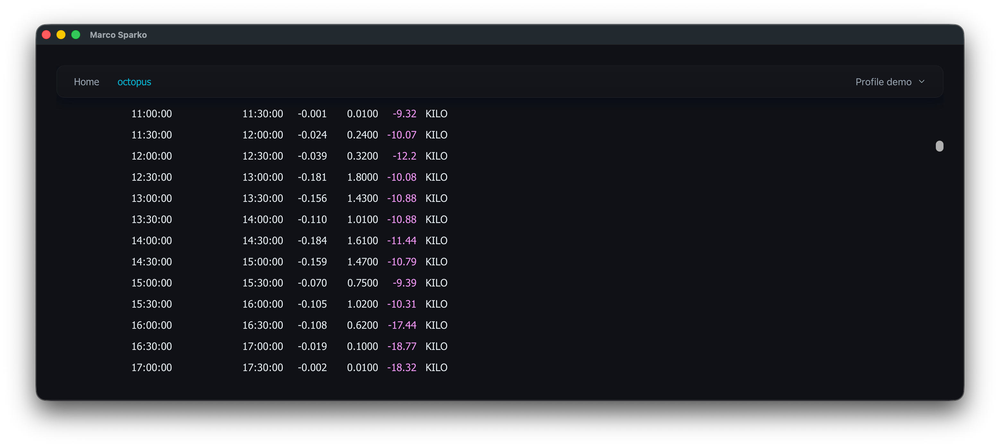

[< Init Octopus](initOctopus.md)
Open he Octopus module page by clicking on ```octopus``` in the top menu bar if necessary, and then click on ```bills``` on the left menu.

If this is the first time you have done this there will be a slight delay while the data for all statements is downloaded. Once this is complete you will see a list of bills in ascending date order like this:



Each line represents a single bill showing the total amounts and the account balance before amd after the bill. The ```Ref``` column is the bill ID as shown on your official statement. This is a clickable link and when you click these links you will see the details for that bill.



The first two sections show the bill details and a summary of charges in a format similar to the official bill.

Values in white text (e.g. ) are from the Octopus API directly.

Values in magenta text (e.g. ) are derived (calculated by the application from data from the API or other derived values). In this case it is because the API provides the Net, Gross and tax amounts but does not specify the rate of tax applied so this is calculated from the amounts.

Values in red text (e.g. ) are error values, generally ```Null``` means a value is null in the data returned from the API and ```None``` means that it is a derived value which depends upon a Null value elsewhere.

As you can see, in this case the rates for this tariff have been deleted, for unknown reasons.

There then follows a detailed breakdown of each of those summary lines where the API provides more detail, in this case both the gas and electricity tariffs are standard tariffs with a single rate, there is only a single line item of detail, which doesn't add anything very useful.

If you click on ```bills``` in the left menu you will see the list of bills again where you can select another to look at.


This is an example of a bill which does not include any energy supply and there are no further details to show.



This is a section from the detailed breakdown section of a bill including an agile export tariff. We now see a separate line for each 30 minute charge period showing the amount charged and number of units exported. The unit cost in pence is back calculated from values and displayed along side. 



This is an example of a bill including the Intelligent Octopus Go tariff. In this case the detailed breakdown shows
the Tariff being applied and the individual 30 minute charge periods amalgamated for each change of rate. The unit cost in pence is back calculated from the number of units and the charge and displayed along side. This shows that when an Intelligent Octopus Go smart charge session is triggered (as it was from 14:30 on the 17th until 05:30 the following day) that all consumption during that period is billed at the cheap rate.

Finally the consumption analysis section shows us the total amounts per charge rate, I have solar and batteries and July has been very sunny so as you can see I have managed to keep my consumption almost entirely at the cheap rate.


[< Documentation Home](../index.md)