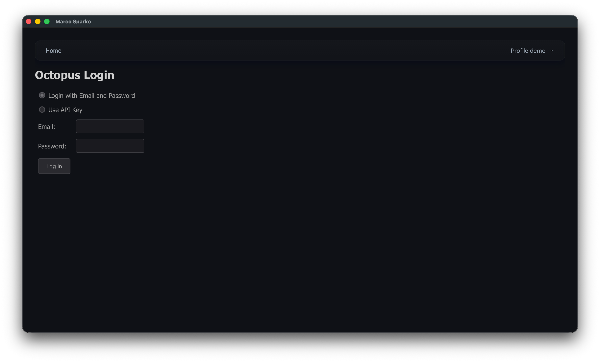
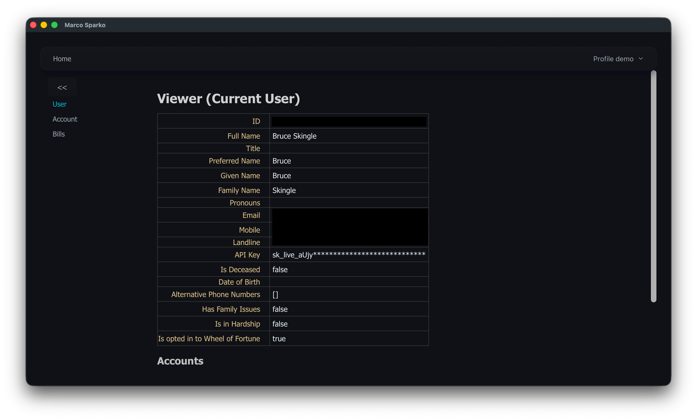
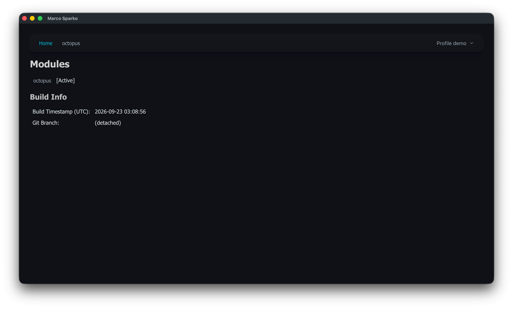

[< Getting Started](index.md)

# Initialize Octopus

To set up access to your Octopus Energy account click on the ```octopus``` module in the list on the home page. You will then see a login page like this:




There are currently two supported ways of logging in, you can either user your email address and password (the same one you use to log into the Octopus website or mobile app) or your API Key. Using your email and password is more secure insofar as the login credentials are not stored anywhere, but you will periodically need to log in again. Using your API Key is more convenient in that it is a one time operation and you will never need to reauthenticate unless your API Key is invalidated. You can only obtain your API Key by generating a new one and that invalidates any existing key, if you use this method the key will be saved to a file in your home directory. Anyone who has possession of that key can log in and perform any action in the Octopus system which you could perform.

Start by entering your email and password and then click ```Log In```

You will then see the ```User```screen of the Octopus module which shows some details about you which are held by Octopus.

On the left of the screen you will see the module menu, which you can click on to access other pages.



If you now quit the application (by closing it's window) and look at the file ```.marco-sparko``` in your home directory you will find the following content:

```json
[
  {
    "name": "default",
    "modules": {
      "octopus": {
        "apiKey": null,
        "billingTimezone": "Europe/London"
      }
    }
  }
]
```
Note that this file is updated as the program exits so you need to quit the application to see this update. As we authenticated with your email and password the apiKey attribute is ```null```, if you authenticate using your API Key then this is where it will be stored.

If you check the file permissions (this is how to do it on MacOS)

```
% ls -l .marco-sparko
-rw-------@ 1 bruce  staff  442 23 Sep 09:39 .marco-sparko
```

You will see that the file is read write for you and there is no access to anyone else.

If you launch the application again you will see that you do not have to log in again immediately, and the octopus module is shown as ```[Active]``` and it now also appears on the main menubar at the top of the screen.



If you are wondering how. the application is able to work without logging in the answer lies in the file ```default-octopus.json``` which you will find in a folder called ```.marco-sparko-cache``` in your home directory. That file looks like this:

```json
{
  "token_expires": 1789738008,
  "token": "XXXXXXXXXXXXXXXXXXXXXXXXXXXXXXXXXXXXXXXXXXXXXXXXXXXXXXXXXXXXXXXXXXXXXXXXXXXXXXXXXXXXXXXXXXXXXXXXXXXXXXXXXXXXXXXXXXXXXXXXXXXXXXXXXXXXXXXXXXXXXXXXXXXXXXXXXXXXXXXXXXXXXXXXXXXXXXXXXXXXXXXXXXXXXXXXXXXXXXXXXXXXXXXXXXXXXXXXXXXXXXXXXXXXXXXXXXXXXXXXXXXXXX.XXXXXXXXXXXXXXXXXXXXXXXXXXXXXXXXXXXXXXXXXXXXXXXXXXXXXXXXXXXXXXXXXXXXXXXXXXXXXXXXXXXXXXXXXXXXXXXXXXXXXXXXXXXXXXXXXXXXXXXXXXXXXXXXXXXXXXXXXXXXXXXXXXXXXXXXXXXXXXXXXXXXXXXXXXXXXXXXXXXXXXXXXXXXXXXXXXXXXXXXXXXXXXXXXXXXXXXXXXXXXXXXXXXXXXXXXXXXXXXXXXXXXXXXXXXXXXXXXXXXXXXXXXXXXXXXXXXXXXXXXXXXXXXXXXXXXXXXXXXXXXXXXXXXXXXXXXXX.XXXXXXXXXXXXXXXXXXXXXXXXXXXXXXXXXXXXXXXXXXXXXXXXXXXXXXXXXXXXXXXXXXXXXXXXXXXXXXXXXXXXXXXXXXXXXXXXXXXXXXXXXXXXXXXXXXXXXXXXXXXXXXXXXXXXXXXXXXXXXXXXXXXXXXXXXXXXXXXXXXXXXXXXXXXXXXXXXXXXXXXXXXXXXXXXXXXXXXXXXXXXXXXXXXXXXXXXXXXXXXXXXXXXXXXXXXXXXXXXXXXXXXXXXXXXXXXXXXXXXXXXXXXXXXXXXXXXXXXXXXXXXXXXXXXXXXXXXXXXXXXXXXXXXXXXXXXXXXXXXXXXXXXXXXXXXXXXXXXXXX",
  "refresh_expires": 1790323980,
  "refresh": "XXXXXXXXXXXXXXXXXXXXXXXXXXXXXXXXXXXXXXXXXXXXXXXXXXXXXXXXXXXXXXXX"
}
```

The ```token``` is the short lived bearer token which has to be sent with each API request, and generally is valid for 5 days, the ```refresh``` token can be used to extend the session for a longer period of time. The longevity of these tokens is determined by Octopus and may change at any time.

The ```token``` is a [JSON Web Token (JWT)](https://en.wikipedia.org/wiki/JSON_Web_Token) which is a standard credential type.

It is important to understand that *all* of these credentials allow access to your account in the same way that your email address and password does so you should never share this key with anyone else, and you should not change the access permissions on any of these files.

[View Bills >](bills.md)