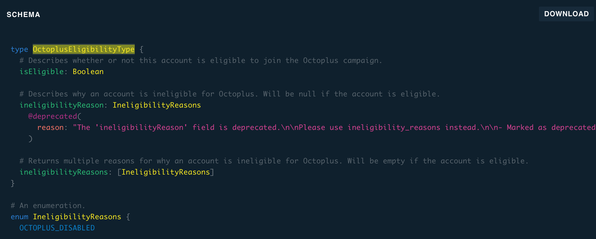

[< Web UI Queries](webUiQueries.md)

# Observed API calls - My Account Page Preamble
This section describes the initial sequence of HTTP requests which I have observed as a result of entering the URL https://octopus.energy/dashboard and my notes as to what is happening. These calls are *NOT* part of the published API and I do *NOT* recommend calling them yourself. They are included here as a way of understanding how the Octopus dashboard UI works in order to understand better the usage of the official API calls which follow.

In the examples here I had previously logged in, if you are not authenticated you will be redirected to the login page and there will be more calls not shown here before the sequence below will follow.

## GET https://octopus.energy/dashboard/
This is a simple HTTP GET request which the results in a `302 Found` response. This is a simple HTTP redirect to `/dashboard/accounts/A-B3D8B29D/` (where the last element is your actual account number) which you can see in the `Location` response header.

The actual web dashboard application obviously knows the user's account number by this point, our GraphQL application will not.

There are then several other redirects eventually getting to

## GET https://octopus.energy/dashboard/new/accounts/A-B3D8B29D/
This is the actual HTML for the web UI.

# Observed API calls - My Account Page GraphQL Queries
This section describes the sequence of GraphQL API calls which I have observed and my notes as to what is happening. As I have already mentioned, this is internal implementation detail and there is every reason to expect that this will change over time, so don't be surprised if you look for yourself and see something different.


## getOctoplusEligibilityandFeatureFlags
### Query
```gql
query getOctoplusEligibilityandFeatureFlags($accountNumber: String!) {
  octoplusAccountInfo(accountNumber: $accountNumber) {
    isOctoplusEnrolled
    octoplusEligibility {
      isEligible
      __typename
    }
    __typename
  }
  octoplusFeatureFlags {
    shouldClientDisplayOctoplus
    __typename
  }
}
"
```

### Variables
```gql
{"accountNumber":"A-B1C2D34E"}
```

### Example Response
```gql
{
  "data": {
    "octoplusAccountInfo": {
      "isOctoplusEnrolled": true,
      "octoplusEligibility": {
        "isEligible": true,
        "__typename": "OctoplusEligibilityType"
      },
      "__typename": "OctoplusAccountInfoType"
    },
    "octoplusFeatureFlags": {
      "shouldClientDisplayOctoplus": true,
      "__typename": "OctoplusFeatureFlagsType"
    }
  }
}
```
This is the first GraphQL call made and it takes the Account Number as a parameter, which must have been retrieved by one of the earlier (non-GraphQL) calls. The account number is in the URL path of some of the redirect URLs so it could be being picked up from there or it may come from one of the other non-GraphQL calls which we have not described. This information is also available in the `My account` section of the website so you can get your own account number that way if you prefer.

In any event, this information is available elsewhere (see `getLoggedInUser` below) so if you are writing a GraphQL application you should get this value like that.

This query is retrieving some information about `Octoplus` which appears to control some aspect of the UI.

The query requests the type names of several of the returned objects (by including `__typename` in the list of fields in the query). It's not clear why the web UI does this, and these will be omitted in most examples. If you want to see the schema definition of the returned type for any query you can just add `__typename` to the list of fields in any query, then click on `SCHEMA` on the right hand edge of the graphql-playground window, type `Ctl-F` (or `COMMAND-f` on a Mac) to find, paste in the typename in the query response (e.g. `OctoplusEligibilityType` in this example) and press `RETURN`.

You should then see the schema definition for the type like this:

## getAccountInfo
### Query
```gql
query getAccountInfo($accountNumber: String!) {
  account(accountNumber: $accountNumber) {
    activeReferralSchemes {
      domestic {
        referralUrl
        referrerRewardAmount
      }
    }
    balance
    accountType
  }
}
```

### Variables
```gql
{"accountNumber":"A-B1C2D34E"}
```

### Example Response
```gql
{
    "data": {
        "account": {
            "activeReferralSchemes": {
                "domestic": {
                    "referralUrl": "https://share.octopus.energy/new-mouse-310",
                    "referrerRewardAmount": 5000
                }
            },
            "balance": 44333,
            "accountType": "DOMESTIC"
        }
    }
}
```

This query fetches some information about the account including the type (`DOMESTIC`) and the current balance (£443.33 in credit in this example). As we can see, currency amounts are represented as scaled integers (or you could think of it as the amount in pence rather than pounds), presumably to avoid issues with rounding floating point numbers.

THere is also data about referral schemes. The `referrerRewardAmount` of `5000` represents £50 but the UI saya `Split £100 with every friend who signs up with this link (if you're on Octoplus, you'll get 800 Octopoints too!)` so I guess the UI is doubling the amount, it must get the 800 Octopints from elsewhere.

## getLoggedInUser
### Query
```gql
query getLoggedInUser {
  viewer {
    accounts {
      number,
      __typename
    },
    __typename
  }
}

```

### Variables
```gql
{}
```

### Example Response
```json
{
    "data": {
        "viewer": {
            "accounts": [
                {
                    "number": "A-B1C2D34E",
                    "__typename": "AccountType"
                }
            ],
            "__typename": "AccountUserType"
        }
    }
}
```

This would most likely be the starting query for a pure GraphQL application. It takes no parameters and returns the Account number for the logged in user. Note that the `accounts` attribute is an array value so you could conceivably receive multiple account numbers back although probably not for domestic consumers.

This is an indication that although Octopus publish their APIs and encourage use of them by consumer end users, they are only one (and probably in many ways, the least important) audience for the API.

Note that ``getLoggedInUser`` is just a label being applied to this query, you will not find that name in the Schema. The actual GraphQL query being accessed is the `viewer` query which provides information about a number of object types linked to the current logged in user (or viewer).

As you can see, the query requests the `__typename` of each of the returned types and the response indicates that the returned object is an `AccountUserType` containing an array with a single objects of type `AccountType`. The schema indicates that `AccountUserType` contains an array of `AccountInterface` objects.

Here is part of the schema definition of `AccountType`:

```gql
# User objects are the core of the authentication system. They typically represent a customer who manages a portfolio of one or more accounts.
type AccountUserType {
  id: ID!

  # List of accounts that the user is linked to either via portfolio role or account role.
  accounts(
    # Optionally filter the user's accounts to only return those linked to portfolios on the specified brands.
    allowedBrandCodes: [BrandChoices]

    # Optionally restrict user accounts to only return those linked to portfolios on public facing brands.
    restrictToPublicFacingBrands: Boolean

    # Optionally restrict user accounts to only return those with the specified account numbers.
    restrictToAccountNumbers: [String]

    # Optionally exclude accounts with any of the given account types.
    excludeAccountTypes: [AccountTypeChoices]

    # Optionally exclude accounts that have never had an agreement.
    excludeAccountsWithoutAgreements: Boolean
  ): [AccountInterface]

# many lines not shown

}
```
And here is part of the definition of `AccountInterface`:

```gql
interface AccountInterface {
  # The brand of the account.
  brand: String

  # The current status of the account.
  status: AccountStatus

# many lines not shown

}
```

If you try to add `eligibilityForWarmHomeDiscount` to the list of attributes returned for the accounts it will not work, because that is not an attribute of `AccountInterface`, although it *is* an attribute of `AccountType`. 

It the case of queries which return an interface, GraphQL servers return the `__typename` of the underlying object rather than the name of the interface. It is also possible to query attributes of the concrete type using GraphQL's `on typename` syntax, which is similar to a programming language type cast. So the query could be rewritten to receive the `getWHDEligibility` attribute for the account like this:

```gql
query getLoggedInUser {
  viewer {
    accounts {
      number
      ...on AccountType {
        eligibilityForWarmHomeDiscount {
            isEligible
        }
      }
    }
  }
}
```

It is unclear why the `AccountInterface` interface exists because the only implementing type in the schema is `AccountType`. The web UI makes a separate request to fetch the `getWHDEligibility` attribute, which may indicate that it's unsafe to rely on the concrete type in this way, or it may not, there is no way to tell.

## getLoggedInUser (again)
### Query
```gql
query getLoggedInUser {
  viewer {
    preferredName
  }
}

```

### Variables
```json
{}
```

### Example Response
```gql
{
  "data": {
    "viewer": {
      "preferredName": "Dan"
    }
  }
}
```

This is a separate call (repeating the name getLoggedInUser) to fetch the user's preferred name. This could have been done as part of the previous call.
## getWHDEligibility
### Query
```gql
query getWHDEligibility($accountNumber: String!) {
  account(accountNumber: $accountNumber) {
    eligibilityForWarmHomeDiscount {
      isEligible
    }
  }
}
```

### Variables
```json
{
    "accountNumber":"A-B1C2D34E"
}
```

### Example Response
```json
{
    "data": {
        "account": {
            "eligibilityForWarmHomeDiscount": {
                "isEligible": false
            }
        }
    }
}
```

This request fetches the account's eligibility for the Warm Home Discount. This could be done in the `viewer` queries above as already discussed.

## getPropertiesMeterPoints
### Query
```gql
query getPropertiesMeterPoints($accountNumber: String!, $propertiesActiveFrom: DateTime) {
  account(accountNumber: $accountNumber) {
    properties(activeFrom: $propertiesActiveFrom) {
      id
      electricityMeterPoints {
        id
        meters(includeInactive: false) {
          id
          smartDevices {
            deviceId
            __typename
          }
          __typename
        }
        __typename
      }
      gasMeterPoints {
        id
        meters {
          id
          smartDevices {
            deviceId
            __typename
          }
          __typename
        }
        __typename
      }
      __typename
    }
    __typename
  }
}
```

### Variables
```json
{
    "accountNumber":"A-B1C2D34E",
    "propertiesActiveFrom":"2024-08-12T23:00:00.000Z"
}
```

### Example Response
```json
{
    "data": {
        "account": {
            "properties": [
                {
                    "id": "2930512",
                    "electricityMeterPoints": [
                        {
                            "id": "2875805",
                            "meters": [
                                {
                                    "id": "3657465",
                                    "smartDevices": [
                                        {
                                            "deviceId": "01-01-01-01-01-01-01-01",
                                            "__typename": "SmartMeterDeviceType"
                                        }
                                    ],
                                    "__typename": "ElectricityMeterType"
                                }
                            ],
                            "__typename": "ElectricityMeterPointType"
                        },
                        {
                            "id": "3347939",
                            "meters": [
                                {
                                    "id": "3839934",
                                    "smartDevices": [
                                        {
                                            "deviceId": "01-01-01-01-01-01-01-01",
                                            "__typename": "SmartMeterDeviceType"
                                        }
                                    ],
                                    "__typename": "ElectricityMeterType"
                                }
                            ],
                            "__typename": "ElectricityMeterPointType"
                        }
                    ],
                    "gasMeterPoints": [
                        {
                            "id": "2383770",
                            "meters": [
                                {
                                    "id": "3274816",
                                    "smartDevices": [
                                        {
                                            "deviceId": "02-02-02-02-02-02-02-02",
                                            "__typename": "SmartMeterDeviceType"
                                        }
                                    ],
                                    "__typename": "GasMeterType"
                                }
                            ],
                            "__typename": "GasMeterPointType"
                        }
                    ],
                    "__typename": "PropertyType"
                }
            ],
            "__typename": "AccountType"
        }
    }
}
```
This query enumerates all the properties (physical locations) associated with the given account, and for each property, all the gas and electricity meter points and their meters and smart devices.

Note that the `id` attribute of the meters here is the value required for the `meterId` parameter of other queries to fetch meter readings and the like.

It is unclear why the particular value for the `propertiesActiveFrom` parameter was chosen, this request was made on August 20 so the given date is about 12 days prior to that.

## getAccount
### Query
```gql
query getAccount($accountNumber: String!, $propertiesActiveFrom: DateTime) {
  account(accountNumber: $accountNumber) {
    applications(first: 1) {
      edges {
        node {
          salesSubchannel
        }
      }
    }
    accountType
    brand
    electricityAgreements(active: true) {
      tariff {
        ... on StandardTariff {
          productCode
        }
        ... on DayNightTariff {
          productCode
        }
        ... on ThreeRateTariff {
          productCode
        }
        ... on HalfHourlyTariff {
          productCode
        }
        ... on PrepayTariff {
          productCode
        }
      }
    }
    status
    number
    balance
    canRenewTariff
    recommendedBalanceAdjustment
    smets2Interest
    canChangePayments
    directDebitInstructions(first: 1) {
      edges {
        node {
          id
        }
      }
    }
    campaigns {
      name
    }
    properties(activeFrom: $propertiesActiveFrom) {
      id
      occupancyPeriods {
        effectiveTo
      }
      electricityMeterPoints {
        id
        mpan
        smartStartDate
        profileClass
        meters {
          hasAndAllowsHhReadings
          serialNumber
          isTradPrepay
          smartDevices {
            paymentMode
            deviceId
          }
          isReadyForTopup
        }
      }
      gasMeterPoints {
        id
        mprn
        smartStartDate
        meters {
          hasAndAllowsHhReadings
          serialNumber
          isTradPrepay
          smartDevices {
            paymentMode
            deviceId
          }
          isReadyForTopup
        }
      }
      isSmets2InstallationAllowed
    }
    bills(first: 1) {
      edges {
        node {
          issuedDate
        }
      }
    }
    transactions(first: 1) {
      edges {
        node {
          id
          amount
          postedDate
          isHeld
          isIssued
          title
          statementId
        }
      }
    }
    repayments(first: 1, statuses: [REQUESTED, APPROVED, SUBMITTED]) {
      edges {
        node {
          id
        }
      }
    }
  }
  fanClubStatus(accountNumber: $accountNumber) {
    discountSource
    accountNumbers
    propertyIds
  }
  balanceForecast(accountNumber: $accountNumber) {
    isAvailable
  }
  viewer {
    preferences {
      isOptedInToUpdateMessages
      isOptedInToOfferMessages
    }
  }
}

```

### Variables
```json
{
    "accountNumber":"A-B1C2D34E",
    "propertiesActiveFrom":"2024-08-12T23:00:00.000Z"
}
```

### Example Response
```json
{
    "data": {
        "account": {
            "applications": {
                "edges": [
                    {
                        "node": {
                            "salesSubchannel": "",
                            "__typename": "AccountApplicationType"
                        },
                        "__typename": "AccountApplicationConnectionTypeEdge"
                    }
                ],
                "__typename": "AccountApplicationConnectionTypeConnection"
            },
            "accountType": "DOMESTIC",
            "brand": "OCTOPUS_ENERGY",
            "electricityAgreements": [
                {
                    "tariff": {
                        "productCode": "OUTGOING-FIX-12M-19-05-13",
                        "__typename": "StandardTariff"
                    },
                    "__typename": "ElectricityAgreementType"
                },
                {
                    "tariff": {
                        "productCode": "INTELLI-VAR-22-10-14",
                        "__typename": "HalfHourlyTariff"
                    },
                    "__typename": "ElectricityAgreementType"
                }
            ],
            "status": "ACTIVE",
            "number": "A-B1C2D34E",
            "balance": 44333,
            "canRenewTariff": false,
            "recommendedBalanceAdjustment": null,
            "smets2Interest": "INTERESTED",
            "canChangePayments": true,
            "directDebitInstructions": {
                "edges": [
                    {
                        "node": {
                            "id": "7991077",
                            "__typename": "DirectDebitInstructionType"
                        },
                        "__typename": "DirectDebitInstructionConnectionTypeEdge"
                    }
                ],
                "__typename": "DirectDebitInstructionConnectionTypeConnection"
            },
            "campaigns": [
                {
                    "name": "Octoplus",
                    "__typename": "AccountCampaignType"
                },
                {
                    "name": "Octoplus Saving Sessions",
                    "__typename": "AccountCampaignType"
                },
                {
                    "name": "Power-Ups UKPN",
                    "__typename": "AccountCampaignType"
                },
                {
                    "name": "SMETS2_CALL_LIST",
                    "__typename": "AccountCampaignType"
                }
            ],
            "properties": [
                {
                    "id": "2930512",
                    "occupancyPeriods": [
                        {
                            "effectiveTo": null,
                            "__typename": "OccupancyPeriodType"
                        }
                    ],
                    "electricityMeterPoints": [
                        {
                            "__typename": "ElectricityMeterPointType",
                            "id": "2875805",
                            "mpan": "1111111111111",
                            "smartStartDate": "2021-08-26",
                            "profileClass": 1,
                            "meters": [
                                {
                                    "hasAndAllowsHhReadings": true,
                                    "serialNumber": "21E1111111",
                                    "isTradPrepay": false,
                                    "smartDevices": [
                                        {
                                            "paymentMode": "CREDIT",
                                            "deviceId": "01-01-01-01-01-01-01-01",
                                            "__typename": "SmartMeterDeviceType"
                                        }
                                    ],
                                    "isReadyForTopup": false,
                                    "__typename": "ElectricityMeterType"
                                }
                            ]
                        },
                        {
                            "__typename": "ElectricityMeterPointType",
                            "id": "3347939",
                            "mpan": "2222222222222",
                            "smartStartDate": "2021-08-26",
                            "profileClass": 8,
                            "meters": [
                                {
                                    "hasAndAllowsHhReadings": true,
                                    "serialNumber": "21E1111111",
                                    "isTradPrepay": false,
                                    "smartDevices": [
                                        {
                                            "paymentMode": "CREDIT",
                                            "deviceId": "01-01-01-01-01-01-01-01",
                                            "__typename": "SmartMeterDeviceType"
                                        }
                                    ],
                                    "isReadyForTopup": false,
                                    "__typename": "ElectricityMeterType"
                                }
                            ]
                        }
                    ],
                    "gasMeterPoints": [
                        {
                            "__typename": "GasMeterPointType",
                            "id": "2383770",
                            "mprn": "3333333333",
                            "smartStartDate": "2021-08-25",
                            "meters": [
                                {
                                    "hasAndAllowsHhReadings": true,
                                    "serialNumber": "E6S22222222222",
                                    "isTradPrepay": false,
                                    "smartDevices": [
                                        {
                                            "paymentMode": "CREDIT",
                                            "deviceId": "02-02-02-02-02-02-02-02",
                                            "__typename": "SmartMeterDeviceType"
                                        }
                                    ],
                                    "isReadyForTopup": false,
                                    "__typename": "GasMeterType"
                                }
                            ]
                        }
                    ],
                    "isSmets2InstallationAllowed": false,
                    "__typename": "PropertyType"
                }
            ],
            "bills": {
                "edges": [
                    {
                        "node": {
                            "issuedDate": "2024-07-22",
                            "__typename": "StatementType"
                        },
                        "__typename": "BillConnectionTypeEdge"
                    }
                ],
                "__typename": "BillConnectionTypeConnection"
            },
            "transactions": {
                "edges": [
                    {
                        "node": {
                            "id": "-1896251302",
                            "amount": 502,
                            "postedDate": "2024-08-14",
                            "isHeld": false,
                            "isIssued": false,
                            "title": "Powerups Reward",
                            "statementId": "236646425",
                            "__typename": "Credit"
                        },
                        "__typename": "TransactionConnectionTypeEdge"
                    }
                ],
                "__typename": "TransactionConnectionTypeConnection"
            },
            "repayments": {
                "edges": [],
                "__typename": "AccountRepaymentConnectionTypeConnection"
            },
            "__typename": "AccountType"
        },
        "fanClubStatus": [],
        "balanceForecast": {
            "isAvailable": false,
            "__typename": "BalanceForecastType"
        },
        "viewer": {
            "preferences": {
                "isOptedInToUpdateMessages": false,
                "isOptedInToOfferMessages": false,
                "__typename": "AccountUserCommsPreferences"
            },
            "__typename": "AccountUserType"
        }
    }
}
```
This looks like a good candidate for the second query of a GraphQL application. It requires the account number as a parameter (and what looks like a more or less arbitrary effective date for properties) and returns a whole host of information including:

* Account Type (DOMESTIC)
* Brand (OCTOPUS_ENERGY)
* Account Status (ACTIVE)
* Balance
* ID of direct debit mandates
* All Gas and Electricity meter points including
    * meterId
    * mpan or mprn
    * Serial Number
    * Smart Device ID
* Date of most recent bill
* Most recent bill transaction
* Most recent repayment

## getOctoPointsBalance
### Query
```gql
query getOctoPointsBalance {
  loyaltyPointLedgers {
    balanceCarriedForward
  }
}
```

### Variables
```json
{}
```

### Example Response
```json
{
    "data": {
        "loyaltyPointLedgers": [
            {
                "balanceCarriedForward": "1524",
            },
            {
                "balanceCarriedForward": "1516",
            },
            {
                "balanceCarriedForward": "1508",
            },
            {
                "balanceCarriedForward": "1308",
            },
            {
                "balanceCarriedForward": "500",
            }
        ]
    }
}
```
Fetches OctoPoints balances.

## getSmartMeterInstallationEligibility
### Query
```gql
query getSmartMeterInstallationEligibility($accountNumber: String!) {
  account(accountNumber: $accountNumber) {
    smets2Interest
    smets2RefusalReason
    properties {
      id
      isSmets2InstallationAllowed
      electricityMeterPoints {
        meters {
          meterType
        }
      }
      gasMeterPoints {
        meters {
          mechanism
        }
      }
    }
  }
}

```

### Variables
```json
{
    "accountNumber":"A-B1C2D34E"
}
```

### Example Response
```json
{
    "data": {
        "account": {
            "smets2Interest": "INTERESTED",
            "smets2RefusalReason": null,
            "properties": [
                {
                    "id": "9999999",
                    "isSmets2InstallationAllowed": false,
                    "electricityMeterPoints": [
                        {
                            "meters": [
                                {
                                    "meterType": "S2ADE"
                                }
                            ]
                        },
                        {
                            "meters": [
                                {
                                    "meterType": "S2ADE"
                                }
                            ]
                        }
                    ],
                    "gasMeterPoints": [
                        {
                            "meters": [
                                {
                                    "mechanism": "S2"
                                }
                            ]
                        }
                    ]
                }
            ]
        }
    }
}
```
Fetch eligibility for smart meter installation.

## getAccount (again)
### Query
```gql
query getAccount($accountNumber: String!, $propertiesActiveFrom: DateTime) {
  account(accountNumber: $accountNumber) {
    cotReadingWindowDays
    properties(activeFrom: $propertiesActiveFrom) {
      id
      address
      occupancyPeriods {
        effectiveTo
      }
      electricityMeterPoints {
        id
        meters(includeInactive: false) {
          id
          serialNumber
          requiresCotFinalReading
        }
        enrolment {
          status
        }
        status
      }
      gasMeterPoints {
        id
        meters {
          id
          serialNumber
          requiresCotFinalReading
        }
        enrolment {
          status
        }
        status
      }
    }
  }
}

```

### Variables
```json
{
    "accountNumber":"A-B1C2D34E",
    "propertiesActiveFrom":"2024-08-12T23:00:00.000Z"
}
```

### Example Response
```json
{
    "data": {
        "account": {
            "cotReadingWindowDays": 2,
            "properties": [
                {
                    "id": "2930512",
                    "address": "Brookfield Farm, Ambridge, Bortchester, Borsetshire, BB12 3AM",
                    "occupancyPeriods": [
                        {
                            "effectiveTo": null,
                            "__typename": "OccupancyPeriodType"
                        }
                    ],
                    "electricityMeterPoints": [
                        {
                            "__typename": "ElectricityMeterPointType",
                            "id": "2875805",
                            "meters": [
                                {
                                    "id": "3657465",
                                    "serialNumber": "21E1111111",
                                    "requiresCotFinalReading": false,
                                    "__typename": "ElectricityMeterType"
                                }
                            ],
                            "enrolment": null,
                            "status": "ON_SUPPLY"
                        },
                        {
                            "__typename": "ElectricityMeterPointType",
                            "id": "3347939",
                            "meters": [
                                {
                                    "id": "3839934",
                                    "serialNumber": "21E1111111",
                                    "requiresCotFinalReading": false,
                                    "__typename": "ElectricityMeterType"
                                }
                            ],
                            "enrolment": null,
                            "status": "ON_SUPPLY"
                        }
                    ],
                    "gasMeterPoints": [
                        {
                            "__typename": "GasMeterPointType",
                            "id": "2383770",
                            "meters": [
                                {
                                    "id": "3274816",
                                    "serialNumber": "E6S22222222222",
                                    "requiresCotFinalReading": false,
                                    "__typename": "GasMeterType"
                                }
                            ],
                            "enrolment": null,
                            "status": "ON_SUPPLY"
                        }
                    ],
                    "__typename": "PropertyType"
                }
            ],
            "__typename": "AccountType"
        }
    }
}
```
Yet another fetch of account details with slightly different attributes including address.

## paymentSchedules
### Query
```gql
query paymentSchedules($accountNumber: String!, $statuses: [DirectDebitInstructionStatus]) {
  account(accountNumber: $accountNumber) {
    directDebitInstructions(first: 5, statuses: $statuses) {
      pageInfo {
        startCursor
      }
    }
    paymentSchedules(first: 10, canCreatePayment: true) {
      edges {
        node {
          supplementaryLedger {
            ledgerType
          }
          id
          paymentAmount
          paymentDay
          validTo
          validFrom
          isVariablePaymentAmount
          reason
          paymentAdequacyAdjustment
          paymentAdequacyAdjustmentExpiryDate
          totalDebtAmount
          paymentFrequency
          paymentFrequencyMultiplier
        }
      }
    }
  }
}
```

### Variables
```json
{
    "accountNumber":"A-B1C2D34E",
    "statuses":["ACTIVE","PROVISIONAL"]}
```

### Example Response
```json
{
    "data": {
        "account": {
            "directDebitInstructions": {
                "pageInfo": {
                    "startCursor": "YXJyYXljb25uZWN0aW9uOjA="
                }
            },
            "paymentSchedules": {
                "edges": [
                    {
                        "node": {
                            "supplementaryLedger": null,
                            "id": "99999999",
                            "paymentAmount": 10221,
                            "paymentDay": 28,
                            "validTo": null,
                            "validFrom": "9999-99-99",
                            "isVariablePaymentAmount": false,
                            "reason": "GENERAL_ACCOUNT_PAYMENT",
                            "paymentAdequacyAdjustment": 0,
                            "paymentAdequacyAdjustmentExpiryDate": null,
                            "totalDebtAmount": 0,
                            "paymentFrequency": "Monthly",
                            "paymentFrequencyMultiplier": 1
                        }
                    },
                    {
                        "node": {
                            "supplementaryLedger": {
                                "ledgerType": "GOODS"
                            },
                            "id": "99999999",
                            "paymentAmount": 0,
                            "paymentDay": 1,
                            "validTo": null,
                            "validFrom": "9999-99-99",
                            "isVariablePaymentAmount": true,
                            "reason": "GENERAL_ACCOUNT_PAYMENT",
                            "paymentAdequacyAdjustment": 0,
                            "paymentAdequacyAdjustmentExpiryDate": null,
                            "totalDebtAmount": 0,
                            "paymentFrequency": "Monthly",
                            "paymentFrequencyMultiplier": 1
                        }
                    },
                    {
                        "node": {
                            "supplementaryLedger": {
                                "ledgerType": "ELECTRIC_JUICE"
                            },
                            "id": "99999999",
                            "paymentAmount": 0,
                            "paymentDay": 1,
                            "validTo": null,
                            "validFrom": "9999-99-99",
                            "isVariablePaymentAmount": true,
                            "reason": "GENERAL_ACCOUNT_PAYMENT",
                            "paymentAdequacyAdjustment": 0,
                            "paymentAdequacyAdjustmentExpiryDate": null,
                            "totalDebtAmount": 0,
                            "paymentFrequency": "Monthly",
                            "paymentFrequencyMultiplier": 1
                        }
                    }
                ]
            }
        }
    }
}
```
Fetches the schedule on which direct debits will be made. I think the first one (without a `supplementaryLedger`) is the regular monthly charge for gas and electricity, the second (`GOODS`) one relates to supply of physical goods, possibly related to a heat pump install, and the `ELECTRIC_JUICE` one relates to Electroverse car charging.

## getLedgers
### Query
```gql
query getLedgers($accountNumber: String!) {
  account(accountNumber: $accountNumber) {
    ledgers {
      ledgerType
      balance
    }
  }
}
```

### Variables
```json
{
    "accountNumber":"A-B1C2D34E"
}
```

### Example Response
```json
{
    "data": {
        "account": {
            "ledgers": [
                {
                    "ledgerType": "MAIN",
                    "balance": 44333
                },
                {
                    "ledgerType": "GOODS",
                    "balance": -288550
                },
                {
                    "ledgerType": "ELECTRIC_JUICE",
                    "balance": 0
                }
            ]
        }
    }
}
```
Fetch the current balance on each individual ledger relating to the account. Again I believe that
`MAIN` is the regular monthly charge for gas and electricity, `GOODS` relates to supply of physical goods, possibly related to a heat pump install, and `ELECTRIC_JUICE` relates to Electroverse car charging.

I have  heat pump install pending and the negative GOODS charge is not reflected in my current account balance so something elsewhere must indicate that this payment is not yet due.


[My Energy Page Queries >](webUiQueriesMyEnergy.md)
