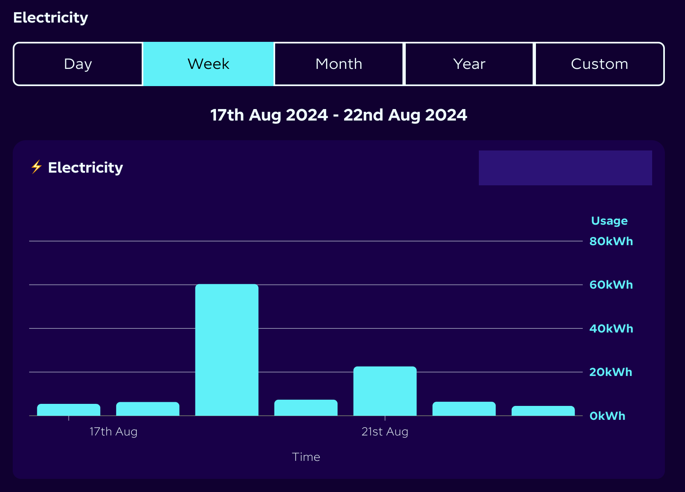
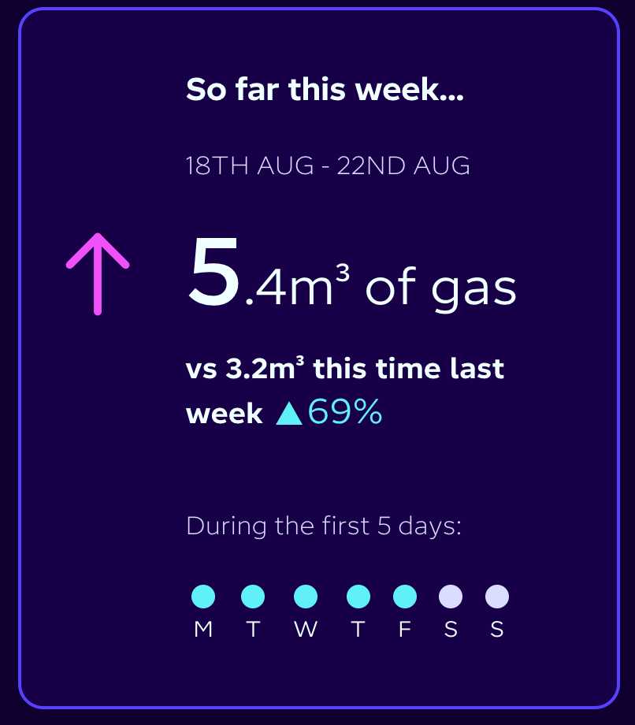
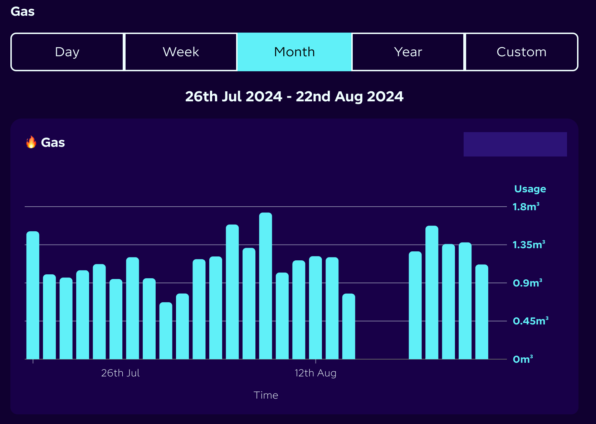

[< My Account Page GraphQL Queries](webUiQueriesDashboard.md)

# Observed API calls - My Energy Page GraphQL Queries

## getAccountPropertiesMeters
### Query
```gql
query getAccountPropertiesMeters($accountNumber: String!) {
  account(accountNumber: $accountNumber) {
    properties {
      id
      address
      postcode
      electricityMeterPoints {
        __typename
        mpan
        status
        meters(includeInactive: false) {
          nodeId
          serialNumber
          consumptionUnits
          hasAndAllowsHhReadings
          importMeter {
            id
            __typename
          }
          __typename
        }
      }
      gasMeterPoints {
        __typename
        mprn
        status
        meters(includeInactive: false) {
          nodeId
          serialNumber
          consumptionUnits
          hasAndAllowsHhReadings
          __typename
        }
      }
      smartDeviceNetworks {
        smartDevices {
          deviceId
          type
          __typename
        }
        __typename
      }
      __typename
    }
    __typename
  }
}
```

### Variables
```json
{
  "accountNumber":"A-B1C2D34E"
}
```

### Example Response
```json
{
    "data": {
        "account": {
            "properties": [
                {
                    "id": "2930512",
                    "address": "Brookfield Farm, Ambridge, Bortchester, Borsetshire, BB12 3AM",
                    "postcode": "BB12 3AM",
                    "electricityMeterPoints": [
                        {
                            "__typename": "ElectricityMeterPointType",
                            "mpan": "1111111111111",
                            "status": "ON_SUPPLY",
                            "meters": [
                                {
                                    "nodeId": "RWxlY3RyaWNpdHlNZXRlclR5cGU6MzY1NzQ2NQ==",
                                    "serialNumber": "21E1111111",
                                    "consumptionUnits": "kWh",
                                    "hasAndAllowsHhReadings": true,
                                    "importMeter": null,
                                    "__typename": "ElectricityMeterType"
                                }
                            ]
                        },
                        {
                            "__typename": "ElectricityMeterPointType",
                            "mpan": "2222222222222",
                            "status": "ON_SUPPLY",
                            "meters": [
                                {
                                    "nodeId": "RWxlY3RyaWNpdHlNZXRlclR5cGU6MzgzOTkzNA==",
                                    "serialNumber": "21E1111111",
                                    "consumptionUnits": "kWh",
                                    "hasAndAllowsHhReadings": true,
                                    "importMeter": {
                                        "id": "3657465",
                                        "__typename": "ElectricityMeterType"
                                    },
                                    "__typename": "ElectricityMeterType"
                                }
                            ]
                        }
                    ],
                    "gasMeterPoints": [
                        {
                            "__typename": "GasMeterPointType",
                            "mprn": "3333333333",
                            "status": "ON_SUPPLY",
                            "meters": [
                                {
                                    "nodeId": "R2FzTWV0ZXJUeXBlOjMyNzQ4MTY=",
                                    "serialNumber": "E6S22222222222",
                                    "consumptionUnits": "m\u00b3",
                                    "hasAndAllowsHhReadings": true,
                                    "__typename": "GasMeterType"
                                }
                            ]
                        }
                    ],
                    "smartDeviceNetworks": [
                        {
                            "smartDevices": [
                                {
                                    "deviceId": "01-01-01-01-01-01-01-01",
                                    "type": "ESME",
                                    "__typename": "SmartMeterDeviceType"
                                },
                                {
                                    "deviceId": "02-02-02-02-02-02-02-02",
                                    "type": "GSME",
                                    "__typename": "SmartMeterDeviceType"
                                },
                                {
                                    "deviceId": "03-03-03-03-03-03-03-03",
                                    "type": "PPMID",
                                    "__typename": "SmartMeterDeviceType"
                                },
                                {
                                    "deviceId": "04-04-04-04-04-04-04-04",
                                    "type": "CHF",
                                    "__typename": "SmartMeterDeviceType"
                                },
                                {
                                    "deviceId": "05-05-05-05-05-05-05-05",
                                    "type": "GPF",
                                    "__typename": "SmartMeterDeviceType"
                                }
                            ],
                            "__typename": "SmartMeterDeviceNetworkType"
                        }
                    ],
                    "__typename": "PropertyType"
                }
            ],
            "__typename": "AccountType"
        }
    }
}
```
Query for all the meter points, meters and smart devices at all the properties included in an account.

## getSmartMeterTelemetry
### Query
```gql
query getSmartMeterTelemetry($meterDeviceId: String!, $start: DateTime, $end: DateTime, $grouping: TelemetryGrouping) {
  smartMeterTelemetry(deviceId: $meterDeviceId, start: $start, end: $end, grouping: $grouping) {
    readAt
    consumption
    demand
    __typename
  }
}
```

### Variables
```json
{
  "meterDeviceId":"01-01-01-01-01-01-01-01"
}
```

### Example Response
```json
{"data":{"smartMeterTelemetry":[]}}
```
A query to fetch the smart meter telemetry for the electricity meter which produces an empty result.

## meterAgreements
### Query
```gql
query meterAgreements($nodeId: ID!, $validAfter: DateTime) {
  node(id: $nodeId) {
    ... on ElectricityMeterType {
      meterPoint {
        mpan
        agreements(excludeFuture: false, validAfter: $validAfter) {
          id
          validFrom
          validTo
          tariff {
            ... on HalfHourlyTariff {
              displayName
              __typename
            }
            __typename
          }
          __typename
        }
        __typename
      }
      __typename
    }
    ... on GasMeterType {
      meterPoint {
        agreements(excludeFuture: false, validAfter: $validAfter) {
          id
          validFrom
          validTo
          __typename
        }
        __typename
      }
      __typename
    }
    __typename
  }
}
```

### Variables
```json
{"nodeId":"RWxlY3RyaWNpdHlNZXRlclR5cGU6MzY1NzQ2NQ==",
"validAfter":"2015-01-01T00:00:00.000Z"
}
```

### Example Response
```json
{
    "data": {
        "node": {
            "meterPoint": {
                "mpan": "1111111111111",
                "agreements": [
                    {
                        "id": 6131567,
                        "validFrom": "2021-05-20T23:00:00+00:00",
                        "validTo": "2023-05-20T23:00:00+00:00",
                        "tariff": {
                            "__typename": "StandardTariff"
                        },
                        "__typename": "ElectricityAgreementType"
                    },
                    {
                        "id": 17703526,
                        "validFrom": "2023-05-20T23:00:00+00:00",
                        "validTo": "2023-10-09T23:00:00+00:00",
                        "tariff": {
                            "__typename": "StandardTariff"
                        },
                        "__typename": "ElectricityAgreementType"
                    },
                    {
                        "id": 19979313,
                        "validFrom": "2023-10-09T23:00:00+00:00",
                        "validTo": "2024-08-07T23:00:00+00:00",
                        "tariff": {
                            "displayName": "Octopus Go",
                            "__typename": "HalfHourlyTariff"
                        },
                        "__typename": "ElectricityAgreementType"
                    },
                    {
                        "id": 29871002,
                        "validFrom": "2024-08-07T23:00:00+00:00",
                        "validTo": null,
                        "tariff": {
                            "displayName": "Intelligent Octopus Go",
                            "__typename": "HalfHourlyTariff"
                        },
                        "__typename": "ElectricityAgreementType"
                    }
                ],
                "__typename": "ElectricityMeterPointType"
            },
            "__typename": "ElectricityMeterType"
        }
    }
}
```
Fetch all the electricity import tariffs.

## meterAgreements (again with different variables)
### Query
As above

### Variables
```json
{
    "nodeId":"RWxlY3RyaWNpdHlNZXRlclR5cGU6MzgzOTkzNA==",
    "validAfter":"2015-01-01T00:00:00.000Z"
}
```

### Example Response
```json
{
    "data": {
        "node": {
            "meterPoint": {
                "mpan": "2222222222222",
                "agreements": [
                    {
                        "id": 7524565,
                        "validFrom": "2021-10-01T23:00:00+00:00",
                        "validTo": "2022-10-01T23:00:00+00:00",
                        "tariff": {
                            "displayName": "Agile Outgoing Octopus",
                            "__typename": "HalfHourlyTariff"
                        },
                        "__typename": "ElectricityAgreementType"
                    },
                    {
                        "id": 10757952,
                        "validFrom": "2022-10-01T23:00:00+00:00",
                        "validTo": "2023-10-01T23:00:00+00:00",
                        "tariff": {
                            "displayName": "Agile Outgoing Octopus",
                            "__typename": "HalfHourlyTariff"
                        },
                        "__typename": "ElectricityAgreementType"
                    },
                    {
                        "id": 19788270,
                        "validFrom": "2023-10-01T23:00:00+00:00",
                        "validTo": "2023-10-09T23:00:00+00:00",
                        "tariff": {
                            "displayName": "Agile Outgoing Octopus",
                            "__typename": "HalfHourlyTariff"
                        },
                        "__typename": "ElectricityAgreementType"
                    },
                    {
                        "id": 20106737,
                        "validFrom": "2023-10-09T23:00:00+00:00",
                        "validTo": "2024-08-12T23:00:00+00:00",
                        "tariff": {
                            "__typename": "StandardTariff"
                        },
                        "__typename": "ElectricityAgreementType"
                    },
                    {
                        "id": 29943123,
                        "validFrom": "2024-08-12T23:00:00+00:00",
                        "validTo": "2025-08-12T23:00:00+00:00",
                        "tariff": {
                            "__typename": "StandardTariff"
                        },
                        "__typename": "ElectricityAgreementType"
                    }
                ],
                "__typename": "ElectricityMeterPointType"
            },
            "__typename": "ElectricityMeterType"
        }
    }
}
```
Fetch all the electricity export tariffs.

## meterAgreements (yet again with different variables)
### Query
As above

### Variables
```json
{"nodeId":"R2FzTWV0ZXJUeXBlOjMyNzQ4MTY=",
    "validAfter":"2015-01-01T00:00:00.000Z"
}
```

### Example Response
```json
{
    "data": {
        "node": {
            "meterPoint": {
                "agreements": [
                    {
                        "id": 5097933,
                        "validFrom": "2021-05-20T23:00:00+00:00",
                        "validTo": "2023-05-20T23:00:00+00:00",
                        "__typename": "GasAgreementType"
                    },
                    {
                        "id": 13560596,
                        "validFrom": "2023-05-20T23:00:00+00:00",
                        "validTo": null,
                        "__typename": "GasAgreementType"
                    }
                ],
                "__typename": "GasMeterPointType"
            },
            "__typename": "GasMeterType"
        }
    }
}
```
Fetch all the electricity import tariffs, note the lack of names.

## consumption
### Query
```gql
query consumption($nodeId: ID!, $grouping: ConsumptionGroupings!, $previousPeriodStart: DateTime!, $mostRecentPeriodStart: DateTime!, $first: Int, $timezone: String!) {
  node(id: $nodeId) {
    ... on ElectricityMeterType {
      ...comparisonFields
      __typename
    }
    ... on GasMeterType {
      ...comparisonFields
      __typename
    }
    __typename
  }
}

fragment comparisonFields on Meter {
  consumptionUnits
  previousPeriodConsumption: consumption(first: $first, grouping: $grouping, startAt: $previousPeriodStart, timezone: $timezone) {
    ...consumptionFields
    __typename
  }
  mostRecentPeriodConsumption: consumption(first: $first, grouping: $grouping, startAt: $mostRecentPeriodStart, timezone: $timezone) {
    ...consumptionFields
    __typename
  }
  serialNumber
  __typename
}

fragment consumptionFields on ConsumptionConnection {
  edges {
    node {
      consumption: value
      intervalStart: startAt
      __typename
    }
    __typename
  }
  __typename
}
```

### Variables
```json
{
  "nodeId":"RWxlY3RyaWNpdHlNZXRlclR5cGU6MzY1NzQ2NQ==",
  "previousPeriodStart":"2024-08-12T01:00:00.000Z",
  "mostRecentPeriodStart":"2024-08-19T00:00:00.000Z",
  "first":5,
  "grouping":"DAY",
  "timezone":"Europe/London"
}
```

### Example Response
```json
{
    "data": {
        "node": {
            "consumptionUnits": "kWh",
            "previousPeriodConsumption": {
                "edges": [
                    {
                        "node": {
                            "consumption": "25.1810000000000000",
                            "intervalStart": "2024-08-12T02:00:00+01:00",
                            "__typename": "ConsumptionType"
                        },
                        "__typename": "ConsumptionEdge"
                    },
                    {
                        "node": {
                            "consumption": "54.0540000000000000",
                            "intervalStart": "2024-08-13T00:00:00+01:00",
                            "__typename": "ConsumptionType"
                        },
                        "__typename": "ConsumptionEdge"
                    },
                    {
                        "node": {
                            "consumption": "27.4170000000000000",
                            "intervalStart": "2024-08-14T00:00:00+01:00",
                            "__typename": "ConsumptionType"
                        },
                        "__typename": "ConsumptionEdge"
                    },
                    {
                        "node": {
                            "consumption": "5.9960000000000000",
                            "intervalStart": "2024-08-15T00:00:00+01:00",
                            "__typename": "ConsumptionType"
                        },
                        "__typename": "ConsumptionEdge"
                    },
                    {
                        "node": {
                            "consumption": "5.0410000000000000",
                            "intervalStart": "2024-08-16T00:00:00+01:00",
                            "__typename": "ConsumptionType"
                        },
                        "__typename": "ConsumptionEdge"
                    }
                ],
                "__typename": "ConsumptionConnection"
            },
            "mostRecentPeriodConsumption": {
                "edges": [
                    {
                        "node": {
                            "consumption": "56.4660000000000000",
                            "intervalStart": "2024-08-19T01:00:00+01:00",
                            "__typename": "ConsumptionType"
                        },
                        "__typename": "ConsumptionEdge"
                    },
                    {
                        "node": {
                            "consumption": "7.3570000000000000",
                            "intervalStart": "2024-08-20T00:00:00+01:00",
                            "__typename": "ConsumptionType"
                        },
                        "__typename": "ConsumptionEdge"
                    },
                    {
                        "node": {
                            "consumption": "22.5890000000000000",
                            "intervalStart": "2024-08-21T00:00:00+01:00",
                            "__typename": "ConsumptionType"
                        },
                        "__typename": "ConsumptionEdge"
                    },
                    {
                        "node": {
                            "consumption": "6.4130000000000000",
                            "intervalStart": "2024-08-22T00:00:00+01:00",
                            "__typename": "ConsumptionType"
                        },
                        "__typename": "ConsumptionEdge"
                    },
                    {
                        "node": {
                            "consumption": "4.5210000000000000",
                            "intervalStart": "2024-08-23T00:00:00+01:00",
                            "__typename": "ConsumptionType"
                        },
                        "__typename": "ConsumptionEdge"
                    }
                ],
                "__typename": "ConsumptionConnection"
            },
            "serialNumber": "21E1111111",
            "__typename": "ElectricityMeterType"
        }
    }
}
```
Fetch the daily total consumption of electricity for the first 5 days of the current and previous week. This query was issued on a Saturday (day 6) so this provides all the data required to draw the displayed bar chart:



It's unclear to me why it makes the query in two parts like this. 

## consumption again with different variables
### Query
As above

### Variables
```json
{
  "nodeId":"RWxlY3RyaWNpdHlNZXRlclR5cGU6MzgzOTkzNA==",
  "previousPeriodStart":"2024-08-12T01:00:00.000Z",
  "mostRecentPeriodStart":"2024-08-19T00:00:00.000Z",
  "first":5,
  "grouping":"DAY",
  "timezone":"Europe/London"
}
```

### Example Response
```json
{
    "data": {
        "node": {
            "consumptionUnits": "kWh",
            "previousPeriodConsumption": {
                "edges": [
                    {
                        "node": {
                            "consumption": "18.1310000000000000",
                            "intervalStart": "2024-08-12T02:00:00+01:00",
                            "__typename": "ConsumptionType"
                        },
                        "__typename": "ConsumptionEdge"
                    },
                    {
                        "node": {
                            "consumption": "27.4020000000000000",
                            "intervalStart": "2024-08-13T00:00:00+01:00",
                            "__typename": "ConsumptionType"
                        },
                        "__typename": "ConsumptionEdge"
                    },
                    {
                        "node": {
                            "consumption": "15.7120000000000000",
                            "intervalStart": "2024-08-14T00:00:00+01:00",
                            "__typename": "ConsumptionType"
                        },
                        "__typename": "ConsumptionEdge"
                    },
                    {
                        "node": {
                            "consumption": "23.6500000000000000",
                            "intervalStart": "2024-08-15T00:00:00+01:00",
                            "__typename": "ConsumptionType"
                        },
                        "__typename": "ConsumptionEdge"
                    },
                    {
                        "node": {
                            "consumption": "32.4540000000000000",
                            "intervalStart": "2024-08-16T00:00:00+01:00",
                            "__typename": "ConsumptionType"
                        },
                        "__typename": "ConsumptionEdge"
                    }
                ],
                "__typename": "ConsumptionConnection"
            },
            "mostRecentPeriodConsumption": {
                "edges": [
                    {
                        "node": {
                            "consumption": "3.2180000000000000",
                            "intervalStart": "2024-08-19T01:00:00+01:00",
                            "__typename": "ConsumptionType"
                        },
                        "__typename": "ConsumptionEdge"
                    },
                    {
                        "node": {
                            "consumption": "24.0670000000000000",
                            "intervalStart": "2024-08-20T00:00:00+01:00",
                            "__typename": "ConsumptionType"
                        },
                        "__typename": "ConsumptionEdge"
                    },
                    {
                        "node": {
                            "consumption": "18.0450000000000000",
                            "intervalStart": "2024-08-21T00:00:00+01:00",
                            "__typename": "ConsumptionType"
                        },
                        "__typename": "ConsumptionEdge"
                    },
                    {
                        "node": {
                            "consumption": "9.3650000000000000",
                            "intervalStart": "2024-08-22T00:00:00+01:00",
                            "__typename": "ConsumptionType"
                        },
                        "__typename": "ConsumptionEdge"
                    },
                    {
                        "node": {
                            "consumption": "0E-20",
                            "intervalStart": "2024-08-23T00:00:00+01:00",
                            "__typename": "ConsumptionType"
                        },
                        "__typename": "ConsumptionEdge"
                    }
                ],
                "__typename": "ConsumptionConnection"
            },
            "serialNumber": "21E1111111",
            "__typename": "ElectricityMeterType"
        }
    }
}
```
As above for electricity export.

## consumption yet again with different variables
### Query
As above

### Variables
```json
{
  "nodeId":"R2FzTWV0ZXJUeXBlOjMyNzQ4MTY=",
  "previousPeriodStart":"2024-08-12T01:00:00.000Z",
  "mostRecentPeriodStart":"2024-08-19T00:00:00.000Z",
  "first":5,
  "grouping":"DAY",
  "timezone":"Europe/London"
}
```

### Example Response
```json
{
    "data": {
        "node": {
            "consumptionUnits": "m\u00b3",
            "previousPeriodConsumption": {
                "edges": [
                    {
                        "node": {
                            "consumption": "1.215",
                            "intervalStart": "2024-08-12T02:00:00+01:00",
                            "__typename": "ConsumptionType"
                        },
                        "__typename": "ConsumptionEdge"
                    },
                    {
                        "node": {
                            "consumption": "1.203",
                            "intervalStart": "2024-08-13T00:00:00+01:00",
                            "__typename": "ConsumptionType"
                        },
                        "__typename": "ConsumptionEdge"
                    },
                    {
                        "node": {
                            "consumption": "0.774",
                            "intervalStart": "2024-08-14T00:00:00+01:00",
                            "__typename": "ConsumptionType"
                        },
                        "__typename": "ConsumptionEdge"
                    },
                    {
                        "node": {
                            "consumption": "0.000",
                            "intervalStart": "2024-08-15T00:00:00+01:00",
                            "__typename": "ConsumptionType"
                        },
                        "__typename": "ConsumptionEdge"
                    },
                    {
                        "node": {
                            "consumption": "0.000",
                            "intervalStart": "2024-08-16T00:00:00+01:00",
                            "__typename": "ConsumptionType"
                        },
                        "__typename": "ConsumptionEdge"
                    }
                ],
                "__typename": "ConsumptionConnection"
            },
            "mostRecentPeriodConsumption": {
                "edges": [
                    {
                        "node": {
                            "consumption": "1.575",
                            "intervalStart": "2024-08-19T01:00:00+01:00",
                            "__typename": "ConsumptionType"
                        },
                        "__typename": "ConsumptionEdge"
                    },
                    {
                        "node": {
                            "consumption": "1.359",
                            "intervalStart": "2024-08-20T00:00:00+01:00",
                            "__typename": "ConsumptionType"
                        },
                        "__typename": "ConsumptionEdge"
                    },
                    {
                        "node": {
                            "consumption": "1.378",
                            "intervalStart": "2024-08-21T00:00:00+01:00",
                            "__typename": "ConsumptionType"
                        },
                        "__typename": "ConsumptionEdge"
                    },
                    {
                        "node": {
                            "consumption": "1.118",
                            "intervalStart": "2024-08-22T00:00:00+01:00",
                            "__typename": "ConsumptionType"
                        },
                        "__typename": "ConsumptionEdge"
                    },
                    {
                        "node": {
                            "consumption": "0.000",
                            "intervalStart": "2024-08-23T00:00:00+01:00",
                            "__typename": "ConsumptionType"
                        },
                        "__typename": "ConsumptionEdge"
                    }
                ],
                "__typename": "ConsumptionConnection"
            },
            "serialNumber": "E6S22222222222",
            "__typename": "GasMeterType"
        }
    }
}
```
The same consumption query for Gas import. The Gas bar chart is set to `Month` rather than `Week` so this must be required to render the "So far thus week" panel:



## getPeriodConsumption
### Query
```gql
query getPeriodConsumption($accountNumber: String!, $first: Int, $startAt: DateTime!, $timezone: String!, $grouping: ConsumptionGroupings!) {
  account(accountNumber: $accountNumber) {
    properties {
      id
      electricityMeterPoints {
        __typename
        id
        meters {
          consumption(first: $first, grouping: $grouping, startAt: $startAt, timezone: $timezone) {
            edges {
              node {
                value
                __typename
              }
              __typename
            }
            __typename
          }
          __typename
        }
      }
      gasMeterPoints {
        __typename
        id
        meters {
          consumption(first: $first, grouping: $grouping, startAt: $startAt, timezone: $timezone) {
            edges {
              node {
                value
                __typename
              }
              __typename
            }
            __typename
          }
          __typename
        }
      }
      __typename
    }
    __typename
  }
}
```

### Variables
```json
{
  "accountNumber":"A-B1C2D34E",
  "first":1,
  "grouping":"MONTH",
  "startAt":"2024-07-31T23:00:00.000Z",
  "timezone":"Europe/London"
}
```

### Example Response
```json
{
    "data": {
        "account": {
            "properties": [
                {
                    "id": "2930512",
                    "electricityMeterPoints": [
                        {
                            "__typename": "ElectricityMeterPointType",
                            "id": "2875805",
                            "meters": [
                                {
                                    "consumption": {
                                        "edges": [
                                            {
                                                "node": {
                                                    "value": "532.7310000000000000",
                                                    "__typename": "ConsumptionType"
                                                },
                                                "__typename": "ConsumptionEdge"
                                            }
                                        ],
                                        "__typename": "ConsumptionConnection"
                                    },
                                    "__typename": "ElectricityMeterType"
                                }
                            ]
                        },
                        {
                            "__typename": "ElectricityMeterPointType",
                            "id": "3347939",
                            "meters": [
                                {
                                    "consumption": {
                                        "edges": [
                                            {
                                                "node": {
                                                    "value": "346.1330000000000000",
                                                    "__typename": "ConsumptionType"
                                                },
                                                "__typename": "ConsumptionEdge"
                                            }
                                        ],
                                        "__typename": "ConsumptionConnection"
                                    },
                                    "__typename": "ElectricityMeterType"
                                }
                            ]
                        }
                    ],
                    "gasMeterPoints": [
                        {
                            "__typename": "GasMeterPointType",
                            "id": "2383770",
                            "meters": [
                                {
                                    "consumption": {
                                        "edges": [
                                            {
                                                "node": {
                                                    "value": "22.711",
                                                    "__typename": "ConsumptionType"
                                                },
                                                "__typename": "ConsumptionEdge"
                                            }
                                        ],
                                        "__typename": "ConsumptionConnection"
                                    },
                                    "__typename": "GasMeterType"
                                }
                            ]
                        }
                    ],
                    "__typename": "PropertyType"
                }
            ],
            "__typename": "AccountType"
        }
    }
}
```
Fetches total consumption for all meters for the month to date (Note the start date is 23:00:00Z as we are on BST (GMT+1) at the moment).

This data does not appear to be displayed.

## smartMeterConsumption__first
### Query
```gql
query smartMeterConsumption__first($meterId: ID!, $grouping: ConsumptionGroupings!, $startAt: DateTime!, $first: Int, $timezone: String!, $cursor: String) {
  node(id: $meterId) {
    ... on ElectricityMeterType {
      ...meterComparisonFields__first
      importMeter {
        id
        __typename
      }
      __typename
    }
    ... on GasMeterType {
      ...meterComparisonFields__first
      __typename
    }
    __typename
  }
}

fragment meterComparisonFields__first on Meter {
  consumptionUnits
  consumption(first: $first, grouping: $grouping, startAt: $startAt, timezone: $timezone, after: $cursor) {
    ...consumptionFields
    __typename
  }
  serialNumber
  __typename
}

fragment consumptionFields on ConsumptionConnection {
  edges {
    node {
      consumption: value
      intervalStart: startAt
      intervalEnd: endAt
      time: startAt
      __typename
    }
    __typename
  }
  pageInfo {
    endCursor
    hasNextPage
    __typename
  }
  __typename
}
```

### Variables
```json
{
  "meterId":"RWxlY3RyaWNpdHlNZXRlclR5cGU6MzY1NzQ2NQ==",
  "grouping":"HALF_HOUR",
  "startAt":"2024-08-23T00:00:00+01:00",
  "first":100,
  "timezone":"Europe/London"
}
```

### Example Response
```json
{
    "data": {
        "node": {
            "consumptionUnits": "kWh",
            "consumption": {
                "edges": [
                    {
                        "node": {
                            "consumption": "2.4790000000000000",
                            "intervalStart": "2024-08-23T00:00:00+01:00",
                            "intervalEnd": "2024-08-23T00:30:00+01:00",
                            "__typename": "ConsumptionType"
                        },
                        "__typename": "ConsumptionEdge"
                    },
                    {
                        "node": {
                            "consumption": "2.0420000000000000",
                            "intervalStart": "2024-08-23T00:30:00+01:00",
                            "intervalEnd": "2024-08-23T01:00:00+01:00",
                            "__typename": "ConsumptionType"
                        },
                        "__typename": "ConsumptionEdge"
                    }
                ],
                "pageInfo": {
                    "endCursor": "YXJyYXljb25uZWN0aW9uOjE=",
                    "hasNextPage": false,
                    "__typename": "PageInfo"
                },
                "__typename": "ConsumptionConnection"
            },
            "serialNumber": "21E1111111",
            "__typename": "ElectricityMeterType",
            "importMeter": null
        }
    }
}
```
Fetch the first 100 consumption records for electricity import starting at midnight the previous day. Note that the `startAt` DateTime is specified as midnight local time (`2024-08-23T00:00:00+01:00`) in this instance, and that only two readings were available at the time of the request.

This data does not appear to be displayed on the page.

## smartMeterConsumption__last
### Query
```gql
query smartMeterConsumption__last($meterId: ID!, $grouping: ConsumptionGroupings!, $startAt: DateTime!, $last: Int, $timezone: String!) {
  node(id: $meterId) {
    ... on ElectricityMeterType {
      ...meterComparisonFields__last
      importMeter {
        id
        __typename
      }
      __typename
    }
    ... on GasMeterType {
      ...meterComparisonFields__last
      __typename
    }
    __typename
  }
}

fragment meterComparisonFields__last on Meter {
  consumptionUnits
  consumption(last: $last, grouping: $grouping, startAt: $startAt, timezone: $timezone) {
    ...consumptionFields
    __typename
  }
  serialNumber
  __typename
}

fragment consumptionFields on ConsumptionConnection {
  edges {
    node {
      consumption: value
      intervalStart: startAt
      intervalEnd: endAt
      time: startAt
      __typename
    }
    __typename
  }
  __typename
}
```

### Variables
```json
{
  "agreementId":13560596,
  "grouping":"DAY",
  "last":29,
  "startAt":"2024-07-24T00:00:00+01:00",
  "timezone":"Europe/London",
  "gasGrouping":"NONE",
  "accountNumber":"A-B1C2D34E",
  "itemType":"CONSUMPTION_CHARGE",
  "meterId":"R2FzTWV0ZXJUeXBlOjMyNzQ4MTY=",
  "lineItemGrouping":"NONE"
}
```

### Example Response
```json
{
    "data": {
        "node": {
            "consumptionUnits": "m\u00b3",
            "consumption": {
                "edges": [
                    {
                        "node": {
                            "consumption": "1.509",
                            "intervalStart": "2024-07-26T00:00:00+01:00",
                            "intervalEnd": "2024-07-27T00:00:00+01:00",
                            "__typename": "ConsumptionType"
                        },
                        "__typename": "ConsumptionEdge"
                    },
                    {
                        "node": {
                            "consumption": "1.001",
                            "intervalStart": "2024-07-27T00:00:00+01:00",
                            "intervalEnd": "2024-07-28T00:00:00+01:00",
                            "__typename": "ConsumptionType"
                        },
                        "__typename": "ConsumptionEdge"
                    },
                    {
                        "node": {
                            "consumption": "0.963",
                            "intervalStart": "2024-07-28T00:00:00+01:00",
                            "intervalEnd": "2024-07-29T00:00:00+01:00",
                            "__typename": "ConsumptionType"
                        },
                        "__typename": "ConsumptionEdge"
                    },
                    {
                        "node": {
                            "consumption": "1.049",
                            "intervalStart": "2024-07-29T00:00:00+01:00",
                            "intervalEnd": "2024-07-30T00:00:00+01:00",
                            "__typename": "ConsumptionType"
                        },
                        "__typename": "ConsumptionEdge"
                    },
                    {
                        "node": {
                            "consumption": "1.122",
                            "intervalStart": "2024-07-30T00:00:00+01:00",
                            "intervalEnd": "2024-07-31T00:00:00+01:00",
                            "__typename": "ConsumptionType"
                        },
                        "__typename": "ConsumptionEdge"
                    },
                    {
                        "node": {
                            "consumption": "0.946",
                            "intervalStart": "2024-07-31T00:00:00+01:00",
                            "intervalEnd": "2024-08-01T00:00:00+01:00",
                            "__typename": "ConsumptionType"
                        },
                        "__typename": "ConsumptionEdge"
                    },
                    {
                        "node": {
                            "consumption": "1.203",
                            "intervalStart": "2024-08-01T00:00:00+01:00",
                            "intervalEnd": "2024-08-02T00:00:00+01:00",
                            "__typename": "ConsumptionType"
                        },
                        "__typename": "ConsumptionEdge"
                    },
                    {
                        "node": {
                            "consumption": "0.955",
                            "intervalStart": "2024-08-02T00:00:00+01:00",
                            "intervalEnd": "2024-08-03T00:00:00+01:00",
                            "__typename": "ConsumptionType"
                        },
                        "__typename": "ConsumptionEdge"
                    },
                    {
                        "node": {
                            "consumption": "0.672",
                            "intervalStart": "2024-08-03T00:00:00+01:00",
                            "intervalEnd": "2024-08-04T00:00:00+01:00",
                            "__typename": "ConsumptionType"
                        },
                        "__typename": "ConsumptionEdge"
                    },
                    {
                        "node": {
                            "consumption": "0.775",
                            "intervalStart": "2024-08-04T00:00:00+01:00",
                            "intervalEnd": "2024-08-05T00:00:00+01:00",
                            "__typename": "ConsumptionType"
                        },
                        "__typename": "ConsumptionEdge"
                    },
                    {
                        "node": {
                            "consumption": "1.180",
                            "intervalStart": "2024-08-05T00:00:00+01:00",
                            "intervalEnd": "2024-08-06T00:00:00+01:00",
                            "__typename": "ConsumptionType"
                        },
                        "__typename": "ConsumptionEdge"
                    },
                    {
                        "node": {
                            "consumption": "1.212",
                            "intervalStart": "2024-08-06T00:00:00+01:00",
                            "intervalEnd": "2024-08-07T00:00:00+01:00",
                            "__typename": "ConsumptionType"
                        },
                        "__typename": "ConsumptionEdge"
                    },
                    {
                        "node": {
                            "consumption": "1.589",
                            "intervalStart": "2024-08-07T00:00:00+01:00",
                            "intervalEnd": "2024-08-08T00:00:00+01:00",
                            "__typename": "ConsumptionType"
                        },
                        "__typename": "ConsumptionEdge"
                    },
                    {
                        "node": {
                            "consumption": "1.313",
                            "intervalStart": "2024-08-08T00:00:00+01:00",
                            "intervalEnd": "2024-08-09T00:00:00+01:00",
                            "__typename": "ConsumptionType"
                        },
                        "__typename": "ConsumptionEdge"
                    },
                    {
                        "node": {
                            "consumption": "1.730",
                            "intervalStart": "2024-08-09T00:00:00+01:00",
                            "intervalEnd": "2024-08-10T00:00:00+01:00",
                            "__typename": "ConsumptionType"
                        },
                        "__typename": "ConsumptionEdge"
                    },
                    {
                        "node": {
                            "consumption": "1.022",
                            "intervalStart": "2024-08-10T00:00:00+01:00",
                            "intervalEnd": "2024-08-11T00:00:00+01:00",
                            "__typename": "ConsumptionType"
                        },
                        "__typename": "ConsumptionEdge"
                    },
                    {
                        "node": {
                            "consumption": "1.166",
                            "intervalStart": "2024-08-11T00:00:00+01:00",
                            "intervalEnd": "2024-08-12T00:00:00+01:00",
                            "__typename": "ConsumptionType"
                        },
                        "__typename": "ConsumptionEdge"
                    },
                    {
                        "node": {
                            "consumption": "1.215",
                            "intervalStart": "2024-08-12T00:00:00+01:00",
                            "intervalEnd": "2024-08-13T00:00:00+01:00",
                            "__typename": "ConsumptionType"
                        },
                        "__typename": "ConsumptionEdge"
                    },
                    {
                        "node": {
                            "consumption": "1.203",
                            "intervalStart": "2024-08-13T00:00:00+01:00",
                            "intervalEnd": "2024-08-14T00:00:00+01:00",
                            "__typename": "ConsumptionType"
                        },
                        "__typename": "ConsumptionEdge"
                    },
                    {
                        "node": {
                            "consumption": "0.774",
                            "intervalStart": "2024-08-14T00:00:00+01:00",
                            "intervalEnd": "2024-08-15T00:00:00+01:00",
                            "__typename": "ConsumptionType"
                        },
                        "__typename": "ConsumptionEdge"
                    },
                    {
                        "node": {
                            "consumption": "0.000",
                            "intervalStart": "2024-08-15T00:00:00+01:00",
                            "intervalEnd": "2024-08-16T00:00:00+01:00",
                            "__typename": "ConsumptionType"
                        },
                        "__typename": "ConsumptionEdge"
                    },
                    {
                        "node": {
                            "consumption": "0.000",
                            "intervalStart": "2024-08-16T00:00:00+01:00",
                            "intervalEnd": "2024-08-17T00:00:00+01:00",
                            "__typename": "ConsumptionType"
                        },
                        "__typename": "ConsumptionEdge"
                    },
                    {
                        "node": {
                            "consumption": "0.000",
                            "intervalStart": "2024-08-17T00:00:00+01:00",
                            "intervalEnd": "2024-08-18T00:00:00+01:00",
                            "__typename": "ConsumptionType"
                        },
                        "__typename": "ConsumptionEdge"
                    },
                    {
                        "node": {
                            "consumption": "1.272",
                            "intervalStart": "2024-08-18T00:00:00+01:00",
                            "intervalEnd": "2024-08-19T00:00:00+01:00",
                            "__typename": "ConsumptionType"
                        },
                        "__typename": "ConsumptionEdge"
                    },
                    {
                        "node": {
                            "consumption": "1.575",
                            "intervalStart": "2024-08-19T00:00:00+01:00",
                            "intervalEnd": "2024-08-20T00:00:00+01:00",
                            "__typename": "ConsumptionType"
                        },
                        "__typename": "ConsumptionEdge"
                    },
                    {
                        "node": {
                            "consumption": "1.359",
                            "intervalStart": "2024-08-20T00:00:00+01:00",
                            "intervalEnd": "2024-08-21T00:00:00+01:00",
                            "__typename": "ConsumptionType"
                        },
                        "__typename": "ConsumptionEdge"
                    },
                    {
                        "node": {
                            "consumption": "1.378",
                            "intervalStart": "2024-08-21T00:00:00+01:00",
                            "intervalEnd": "2024-08-22T00:00:00+01:00",
                            "__typename": "ConsumptionType"
                        },
                        "__typename": "ConsumptionEdge"
                    },
                    {
                        "node": {
                            "consumption": "1.118",
                            "intervalStart": "2024-08-22T00:00:00+01:00",
                            "intervalEnd": "2024-08-23T00:00:00+01:00",
                            "__typename": "ConsumptionType"
                        },
                        "__typename": "ConsumptionEdge"
                    },
                    {
                        "node": {
                            "consumption": "0.000",
                            "intervalStart": "2024-08-23T00:00:00+01:00",
                            "intervalEnd": "2024-08-23T01:00:00+01:00",
                            "__typename": "ConsumptionType"
                        },
                        "__typename": "ConsumptionEdge"
                    }
                ],
                "__typename": "ConsumptionConnection"
            },
            "serialNumber": "E6S22222222222",
            "__typename": "GasMeterType"
        }
    }
}
```
Fetch gas daily consumption data for the previous month. Note this is a `node` query, which we have not seen before. It is specifying the `nodeId` of the meter as well as the agreement (tarif) id. The response includes data up to the previous day. This is presumably used to populate the month view of the gas consumption bar chart:



I suspect it is also used for the comparison with last week, which would explain the naming in the query.

## smartMeterConsumption__last again with different variables
### Query
As above

### Variables
```json
{
  "agreementId":29943123,
  "grouping":"DAY",
  "last":8,
  "startAt":"2024-08-17T00:00:00+01:00",
  "timezone":"Europe/London",
  "gasGrouping":"NONE",
  "accountNumber":"A-B1C2D34E",
  "itemType":"CONSUMPTION_CHARGE",
  "meterId":"RWxlY3RyaWNpdHlNZXRlclR5cGU6MzgzOTkzNA==",
  "lineItemGrouping":"NONE"
}
```

### Example Response
```json
{
    "data": {
        "node": {
            "consumptionUnits": "kWh",
            "consumption": {
                "edges": [
                    {
                        "node": {
                            "consumption": "28.6150000000000000",
                            "intervalStart": "2024-08-17T00:00:00+01:00",
                            "intervalEnd": "2024-08-18T00:00:00+01:00",
                            "__typename": "ConsumptionType"
                        },
                        "__typename": "ConsumptionEdge"
                    },
                    {
                        "node": {
                            "consumption": "25.9320000000000000",
                            "intervalStart": "2024-08-18T00:00:00+01:00",
                            "intervalEnd": "2024-08-19T00:00:00+01:00",
                            "__typename": "ConsumptionType"
                        },
                        "__typename": "ConsumptionEdge"
                    },
                    {
                        "node": {
                            "consumption": "3.2180000000000000",
                            "intervalStart": "2024-08-19T00:00:00+01:00",
                            "intervalEnd": "2024-08-20T00:00:00+01:00",
                            "__typename": "ConsumptionType"
                        },
                        "__typename": "ConsumptionEdge"
                    },
                    {
                        "node": {
                            "consumption": "24.0670000000000000",
                            "intervalStart": "2024-08-20T00:00:00+01:00",
                            "intervalEnd": "2024-08-21T00:00:00+01:00",
                            "__typename": "ConsumptionType"
                        },
                        "__typename": "ConsumptionEdge"
                    },
                    {
                        "node": {
                            "consumption": "18.0450000000000000",
                            "intervalStart": "2024-08-21T00:00:00+01:00",
                            "intervalEnd": "2024-08-22T00:00:00+01:00",
                            "__typename": "ConsumptionType"
                        },
                        "__typename": "ConsumptionEdge"
                    },
                    {
                        "node": {
                            "consumption": "9.3650000000000000",
                            "intervalStart": "2024-08-22T00:00:00+01:00",
                            "intervalEnd": "2024-08-23T00:00:00+01:00",
                            "__typename": "ConsumptionType"
                        },
                        "__typename": "ConsumptionEdge"
                    },
                    {
                        "node": {
                            "consumption": "0E-20",
                            "intervalStart": "2024-08-23T00:00:00+01:00",
                            "intervalEnd": "2024-08-23T01:00:00+01:00",
                            "__typename": "ConsumptionType"
                        },
                        "__typename": "ConsumptionEdge"
                    }
                ],
                "__typename": "ConsumptionConnection"
            },
            "serialNumber": "21E1111111",
            "__typename": "ElectricityMeterType",
            "importMeter": {
                "id": "3657465",
                "__typename": "ElectricityMeterType"
            }
        }
    }
}
```
Fetch electricity export daily "consumption" data for the previous week. This is a repeat of the previous query with hdifferent data.

## smartMeterConsumption__last again with different variables
### Query
As above

### Variables
```json
{
  "agreementId":29871002,
  "grouping":"DAY",
  "last":8,
  "startAt":"2024-08-17T00:00:00+01:00",
  "timezone":"Europe/London",
  "gasGrouping":"NONE",
  "accountNumber":"A-B1C2D34E",
  "itemType":"CONSUMPTION_CHARGE",
  "meterId":"RWxlY3RyaWNpdHlNZXRlclR5cGU6MzY1NzQ2NQ==",
  "lineItemGrouping":"NONE"
}
```

### Example Response
```json
{
    "data": {
        "node": {
            "consumptionUnits": "kWh",
            "consumption": {
                "edges": [
                    {
                        "node": {
                            "consumption": "5.4400000000000000",
                            "intervalStart": "2024-08-17T00:00:00+01:00",
                            "intervalEnd": "2024-08-18T00:00:00+01:00",
                            "__typename": "ConsumptionType"
                        },
                        "__typename": "ConsumptionEdge"
                    },
                    {
                        "node": {
                            "consumption": "6.2900000000000000",
                            "intervalStart": "2024-08-18T00:00:00+01:00",
                            "intervalEnd": "2024-08-19T00:00:00+01:00",
                            "__typename": "ConsumptionType"
                        },
                        "__typename": "ConsumptionEdge"
                    },
                    {
                        "node": {
                            "consumption": "60.3300000000000000",
                            "intervalStart": "2024-08-19T00:00:00+01:00",
                            "intervalEnd": "2024-08-20T00:00:00+01:00",
                            "__typename": "ConsumptionType"
                        },
                        "__typename": "ConsumptionEdge"
                    },
                    {
                        "node": {
                            "consumption": "7.3570000000000000",
                            "intervalStart": "2024-08-20T00:00:00+01:00",
                            "intervalEnd": "2024-08-21T00:00:00+01:00",
                            "__typename": "ConsumptionType"
                        },
                        "__typename": "ConsumptionEdge"
                    },
                    {
                        "node": {
                            "consumption": "22.5890000000000000",
                            "intervalStart": "2024-08-21T00:00:00+01:00",
                            "intervalEnd": "2024-08-22T00:00:00+01:00",
                            "__typename": "ConsumptionType"
                        },
                        "__typename": "ConsumptionEdge"
                    },
                    {
                        "node": {
                            "consumption": "6.4130000000000000",
                            "intervalStart": "2024-08-22T00:00:00+01:00",
                            "intervalEnd": "2024-08-23T00:00:00+01:00",
                            "__typename": "ConsumptionType"
                        },
                        "__typename": "ConsumptionEdge"
                    },
                    {
                        "node": {
                            "consumption": "4.5210000000000000",
                            "intervalStart": "2024-08-23T00:00:00+01:00",
                            "intervalEnd": "2024-08-23T01:00:00+01:00",
                            "__typename": "ConsumptionType"
                        },
                        "__typename": "ConsumptionEdge"
                    }
                ],
                "__typename": "ConsumptionConnection"
            },
            "serialNumber": "21E1111111",
            "__typename": "ElectricityMeterType",
            "importMeter": null
        }
    }
}
```

Fetch electricity import daily consumption data for the previous week. This is a repeat of the previous query with hdifferent data.

## getSmartMeterTelemetry
### Query
```gql
query getSmartMeterTelemetry($meterDeviceId: String!, $start: DateTime, $end: DateTime, $grouping: TelemetryGrouping) {
  smartMeterTelemetry(deviceId: $meterDeviceId, start: $start, end: $end, grouping: $grouping) {
    readAt
    consumption
    demand
    __typename
  }
}
```

### Variables
```json
{
  "meterDeviceId":"01-01-01-01-01-01-01-01"
}
```

### Example Response
```json
{}
```
A repeat query to fetch the smart meter telemetry for the electricity meter which produces an empty result.

# Electricity Import Custom Dates Billed and Used
This query was run on August 24th, the start date was set to August 20th (so should cover 4 days) and `Everything` was selected (show used and billed).

## smartMeterConsumption__first
### Query
```gql
query smartMeterConsumption__first($meterId: ID!, $grouping: ConsumptionGroupings!, $startAt: DateTime!, $first: Int, $timezone: String!) {
  node(id: $meterId) {
    ... on ElectricityMeterType {
      ...meterComparisonFields__first
      importMeter {
        id
        __typename
      }
      __typename
    }
    ... on GasMeterType {
      ...meterComparisonFields__first
      __typename
    }
    __typename
  }
}

fragment meterComparisonFields__first on Meter {
  consumptionUnits
  consumption(first: $first, grouping: $grouping, startAt: $startAt, timezone: $timezone) {
    ...consumptionFields
    __typename
  }
  serialNumber
  __typename
}

fragment consumptionFields on ConsumptionConnection {
  edges {
    node {
      consumption: value
      intervalStart: startAt
      intervalEnd: endAt
      time: startAt
      __typename
    }
    __typename
  }
  __typename
}
```

### Variables
```json
{
    "agreementId":29871002,
    "grouping":"DAY",
    "first":31,
    "startAt":"2024-08-20T00:00:00+01:00",
    "timezone":"Europe/London",
    "gasGrouping":"NONE",
    "accountNumber":"A-B1C2D34E",
    "itemType":"CONSUMPTION_CHARGE",
    "meterId":"RWxlY3RyaWNpdHlNZXRlclR5cGU6MzY1NzQ2NQ==",
    "lineItemGrouping":"NONE"
}
```

### Example Response
```json
{
    "data": {
        "node": {
            "consumptionUnits": "kWh",
            "consumption": {
                "edges": [
                    {
                        "node": {
                            "consumption": "7.3570000000000000",
                            "intervalStart": "2024-08-20T00:00:00+01:00",
                            "intervalEnd": "2024-08-21T00:00:00+01:00",
                            "__typename": "ConsumptionType"
                        },
                        "__typename": "ConsumptionEdge"
                    },
                    {
                        "node": {
                            "consumption": "22.5890000000000000",
                            "intervalStart": "2024-08-21T00:00:00+01:00",
                            "intervalEnd": "2024-08-22T00:00:00+01:00",
                            "__typename": "ConsumptionType"
                        },
                        "__typename": "ConsumptionEdge"
                    },
                    {
                        "node": {
                            "consumption": "6.4130000000000000",
                            "intervalStart": "2024-08-22T00:00:00+01:00",
                            "intervalEnd": "2024-08-23T00:00:00+01:00",
                            "__typename": "ConsumptionType"
                        },
                        "__typename": "ConsumptionEdge"
                    },
                    {
                        "node": {
                            "consumption": "4.5210000000000000",
                            "intervalStart": "2024-08-23T00:00:00+01:00",
                            "intervalEnd": "2024-08-23T01:00:00+01:00",
                            "__typename": "ConsumptionType"
                        },
                        "__typename": "ConsumptionEdge"
                    }
                ],
                "__typename": "ConsumptionConnection"
            },
            "serialNumber": "21E1111111",
            "__typename": "ElectricityMeterType",
            "importMeter": null
        }
    }
}
```
This query fetches the consumed electricity and returns 4 records covering the period from the requested start date to the day before the query was run.

## electricityAgreementLineItems__first
### Query
```gql
query electricityAgreementLineItems__first($agreementId: ID!, $startAt: DateTime!, $first: Int, $timezone: String!, $itemType: LineItemTypeOptions!, $lineItemGrouping: LineItemGroupingOptions!, $lastCursor: String) {
  electricityAgreement(id: $agreementId) {
    ... on ElectricityAgreementType {
      meterPoint {
        mpan
        __typename
      }
      lineItems(first: $first, grouping: $lineItemGrouping, startAt: $startAt, itemType: $itemType, timezone: $timezone, after: $lastCursor) {
        ...lineItems
        __typename
      }
      __typename
    }
    __typename
  }
}

fragment lineItems on LineItemConnection {
  edges {
    node {
      startAt
      endAt
      netAmount
      numberOfUnits
      settlementUnit
      time: startAt
      __typename
    }
    cursor
    __typename
  }
  pageInfo {
    hasNextPage
    hasPreviousPage
    endCursor
    startCursor
    __typename
  }
  __typename
}
```

### Variables
```json
{
    "agreementId":29871002,
    "grouping":"DAY",
    "first":31,
    "startAt":"2024-08-20T00:00:00+01:00",
    "timezone":"Europe/London",
    "gasGrouping":"NONE",
    "accountNumber":"A-B1C2D34E",
    "itemType":"CONSUMPTION_CHARGE",
    "meterId":"RWxlY3RyaWNpdHlNZXRlclR5cGU6MzY1NzQ2NQ==",
    "lineItemGrouping":"NONE"
}
```

### Example Response
```json
{
    "data": {
        "electricityAgreement": {
            "meterPoint": {
                "mpan": "1111111111111",
                "__typename": "ElectricityMeterPointType"
            },
            "lineItems": {
                "edges": [
                    {
                        "node": {
                            "startAt": "2024-08-20T08:00:00+01:00",
                            "endAt": "2024-08-20T19:00:00+01:00",
                            "netAmount": "3.02003",
                            "numberOfUnits": "0.1300",
                            "settlementUnit": "KILOWATT_HOURS",
                            "__typename": "LineItemType"
                        },
                        "cursor": "YXJyYXljb25uZWN0aW9uOjA=",
                        "__typename": "LineItemEdge"
                    },
                    {
                        "node": {
                            "startAt": "2024-08-20T19:00:00+01:00",
                            "endAt": "2024-08-21T00:00:00+01:00",
                            "netAmount": "14.13404",
                            "numberOfUnits": "2.1200",
                            "settlementUnit": "KILOWATT_HOURS",
                            "__typename": "LineItemType"
                        },
                        "cursor": "YXJyYXljb25uZWN0aW9uOjE=",
                        "__typename": "LineItemEdge"
                    }
                ],
                "pageInfo": {
                    "hasNextPage": false,
                    "hasPreviousPage": false,
                    "endCursor": "YXJyYXljb25uZWN0aW9uOjE=",
                    "startCursor": "YXJyYXljb25uZWN0aW9uOjA=",
                    "__typename": "PageInfo"
                },
                "__typename": "LineItemConnection"
            },
            "__typename": "ElectricityAgreementType"
        }
    }
}
```
This query retrieves the meter point line items, which is the amount billed. We only get two records both of which relate to the firt day in the selected range, one for `0.13` kWh for `3.02003` which is a rate of 23.231p / kWh for the period 08:00 - 19:00 and another for `14.13404` for `2.1200` kWh which is a rate of 6.667 p/kWh for the period 19:00 - midnight. These rates are close to, but not exactly, the Intelligent Go tariff rates, the second charge might relate to a smart charge but my charger does not show any charge activity on that day.

## electricityAgreementLineItems__first
The start date for the query was reset to 11th August and this query was sent (the consumption data had already been loaded for the whole month)
### Query
As above

### Variables
```json
{
    "agreementId":29871002,
    "grouping":"DAY",
    "first":31,
    "startAt":"2024-08-11T00:00:00+01:00",
    "timezone":"Europe/London",
    "gasGrouping":"NONE",
    "accountNumber":"A-B1C2D34E",
    "itemType":"CONSUMPTION_CHARGE",
    "meterId":"RWxlY3RyaWNpdHlNZXRlclR5cGU6MzY1NzQ2NQ==",
    "lineItemGrouping":"NONE"
}
```

### Example Response
```json
{
    "data": {
        "electricityAgreement": {
            "meterPoint": {
                "mpan": "1111111111111",
                "__typename": "ElectricityMeterPointType"
            },
            "lineItems": {
                "edges": [
                    {
                        "node": {
                            "startAt": "2024-08-11T08:00:00+01:00",
                            "endAt": "2024-08-11T14:00:00+01:00",
                            "netAmount": "1.85848",
                            "numberOfUnits": "0.0800",
                            "settlementUnit": "KILOWATT_HOURS",
                            "__typename": "LineItemType"
                        },
                        "cursor": "YXJyYXljb25uZWN0aW9uOjA=",
                        "__typename": "LineItemEdge"
                    },
                    {
                        "node": {
                            "startAt": "2024-08-11T14:00:00+01:00",
                            "endAt": "2024-08-11T16:30:00+01:00",
                            "netAmount": "22.93448",
                            "numberOfUnits": "3.4400",
                            "settlementUnit": "KILOWATT_HOURS",
                            "__typename": "LineItemType"
                        },
                        "cursor": "YXJyYXljb25uZWN0aW9uOjE=",
                        "__typename": "LineItemEdge"
                    },
                    {
                        "node": {
                            "startAt": "2024-08-11T16:30:00+01:00",
                            "endAt": "2024-08-11T20:30:00+01:00",
                            "netAmount": "5.80775",
                            "numberOfUnits": "0.2500",
                            "settlementUnit": "KILOWATT_HOURS",
                            "__typename": "LineItemType"
                        },
                        "cursor": "YXJyYXljb25uZWN0aW9uOjI=",
                        "__typename": "LineItemEdge"
                    },
                    {
                        "node": {
                            "startAt": "2024-08-11T20:30:00+01:00",
                            "endAt": "2024-08-12T08:00:00+01:00",
                            "netAmount": "67.73672",
                            "numberOfUnits": "10.1600",
                            "settlementUnit": "KILOWATT_HOURS",
                            "__typename": "LineItemType"
                        },
                        "cursor": "YXJyYXljb25uZWN0aW9uOjM=",
                        "__typename": "LineItemEdge"
                    },
                    {
                        "node": {
                            "startAt": "2024-08-12T08:00:00+01:00",
                            "endAt": "2024-08-12T13:30:00+01:00",
                            "netAmount": "1.62617",
                            "numberOfUnits": "0.0700",
                            "settlementUnit": "KILOWATT_HOURS",
                            "__typename": "LineItemType"
                        },
                        "cursor": "YXJyYXljb25uZWN0aW9uOjQ=",
                        "__typename": "LineItemEdge"
                    },
                    {
                        "node": {
                            "startAt": "2024-08-12T13:30:00+01:00",
                            "endAt": "2024-08-13T08:00:00+01:00",
                            "netAmount": "333.35000",
                            "numberOfUnits": "50.0000",
                            "settlementUnit": "KILOWATT_HOURS",
                            "__typename": "LineItemType"
                        },
                        "cursor": "YXJyYXljb25uZWN0aW9uOjU=",
                        "__typename": "LineItemEdge"
                    },
                    {
                        "node": {
                            "startAt": "2024-08-13T08:00:00+01:00",
                            "endAt": "2024-08-13T17:30:00+01:00",
                            "netAmount": "0.00000",
                            "numberOfUnits": "0.0000",
                            "settlementUnit": "KILOWATT_HOURS",
                            "__typename": "LineItemType"
                        },
                        "cursor": "YXJyYXljb25uZWN0aW9uOjY=",
                        "__typename": "LineItemEdge"
                    },
                    {
                        "node": {
                            "startAt": "2024-08-13T17:30:00+01:00",
                            "endAt": "2024-08-14T08:00:00+01:00",
                            "netAmount": "353.08432",
                            "numberOfUnits": "52.9600",
                            "settlementUnit": "KILOWATT_HOURS",
                            "__typename": "LineItemType"
                        },
                        "cursor": "YXJyYXljb25uZWN0aW9uOjc=",
                        "__typename": "LineItemEdge"
                    },
                    {
                        "node": {
                            "startAt": "2024-08-14T08:00:00+01:00",
                            "endAt": "2024-08-14T19:00:00+01:00",
                            "netAmount": "1.62617",
                            "numberOfUnits": "0.0700",
                            "settlementUnit": "KILOWATT_HOURS",
                            "__typename": "LineItemType"
                        },
                        "cursor": "YXJyYXljb25uZWN0aW9uOjg=",
                        "__typename": "LineItemEdge"
                    },
                    {
                        "node": {
                            "startAt": "2024-08-14T19:00:00+01:00",
                            "endAt": "2024-08-15T08:00:00+01:00",
                            "netAmount": "40.46869",
                            "numberOfUnits": "6.0700",
                            "settlementUnit": "KILOWATT_HOURS",
                            "__typename": "LineItemType"
                        },
                        "cursor": "YXJyYXljb25uZWN0aW9uOjk=",
                        "__typename": "LineItemEdge"
                    },
                    {
                        "node": {
                            "startAt": "2024-08-15T08:00:00+01:00",
                            "endAt": "2024-08-15T19:00:00+01:00",
                            "netAmount": "0.23231",
                            "numberOfUnits": "0.0100",
                            "settlementUnit": "KILOWATT_HOURS",
                            "__typename": "LineItemType"
                        },
                        "cursor": "YXJyYXljb25uZWN0aW9uOjEw",
                        "__typename": "LineItemEdge"
                    },
                    {
                        "node": {
                            "startAt": "2024-08-15T19:00:00+01:00",
                            "endAt": "2024-08-16T08:00:00+01:00",
                            "netAmount": "33.26833",
                            "numberOfUnits": "4.9900",
                            "settlementUnit": "KILOWATT_HOURS",
                            "__typename": "LineItemType"
                        },
                        "cursor": "YXJyYXljb25uZWN0aW9uOjEx",
                        "__typename": "LineItemEdge"
                    },
                    {
                        "node": {
                            "startAt": "2024-08-16T08:00:00+01:00",
                            "endAt": "2024-08-16T19:00:00+01:00",
                            "netAmount": "0.00000",
                            "numberOfUnits": "0.0000",
                            "settlementUnit": "KILOWATT_HOURS",
                            "__typename": "LineItemType"
                        },
                        "cursor": "YXJyYXljb25uZWN0aW9uOjEy",
                        "__typename": "LineItemEdge"
                    },
                    {
                        "node": {
                            "startAt": "2024-08-16T19:00:00+01:00",
                            "endAt": "2024-08-17T08:00:00+01:00",
                            "netAmount": "36.46849",
                            "numberOfUnits": "5.4700",
                            "settlementUnit": "KILOWATT_HOURS",
                            "__typename": "LineItemType"
                        },
                        "cursor": "YXJyYXljb25uZWN0aW9uOjEz",
                        "__typename": "LineItemEdge"
                    },
                    {
                        "node": {
                            "startAt": "2024-08-17T08:00:00+01:00",
                            "endAt": "2024-08-17T19:00:00+01:00",
                            "netAmount": "0.00000",
                            "numberOfUnits": "0.0000",
                            "settlementUnit": "KILOWATT_HOURS",
                            "__typename": "LineItemType"
                        },
                        "cursor": "YXJyYXljb25uZWN0aW9uOjE0",
                        "__typename": "LineItemEdge"
                    },
                    {
                        "node": {
                            "startAt": "2024-08-17T19:00:00+01:00",
                            "endAt": "2024-08-18T08:00:00+01:00",
                            "netAmount": "41.93543",
                            "numberOfUnits": "6.2900",
                            "settlementUnit": "KILOWATT_HOURS",
                            "__typename": "LineItemType"
                        },
                        "cursor": "YXJyYXljb25uZWN0aW9uOjE1",
                        "__typename": "LineItemEdge"
                    },
                    {
                        "node": {
                            "startAt": "2024-08-18T08:00:00+01:00",
                            "endAt": "2024-08-18T19:00:00+01:00",
                            "netAmount": "0.46462",
                            "numberOfUnits": "0.0200",
                            "settlementUnit": "KILOWATT_HOURS",
                            "__typename": "LineItemType"
                        },
                        "cursor": "YXJyYXljb25uZWN0aW9uOjE2",
                        "__typename": "LineItemEdge"
                    },
                    {
                        "node": {
                            "startAt": "2024-08-18T19:00:00+01:00",
                            "endAt": "2024-08-19T08:00:00+01:00",
                            "netAmount": "271.88026",
                            "numberOfUnits": "40.7800",
                            "settlementUnit": "KILOWATT_HOURS",
                            "__typename": "LineItemType"
                        },
                        "cursor": "YXJyYXljb25uZWN0aW9uOjE3",
                        "__typename": "LineItemEdge"
                    },
                    {
                        "node": {
                            "startAt": "2024-08-19T08:00:00+01:00",
                            "endAt": "2024-08-19T10:30:00+01:00",
                            "netAmount": "0.23231",
                            "numberOfUnits": "0.0100",
                            "settlementUnit": "KILOWATT_HOURS",
                            "__typename": "LineItemType"
                        },
                        "cursor": "YXJyYXljb25uZWN0aW9uOjE4",
                        "__typename": "LineItemEdge"
                    },
                    {
                        "node": {
                            "startAt": "2024-08-19T10:30:00+01:00",
                            "endAt": "2024-08-19T16:00:00+01:00",
                            "netAmount": "128.67310",
                            "numberOfUnits": "19.3000",
                            "settlementUnit": "KILOWATT_HOURS",
                            "__typename": "LineItemType"
                        },
                        "cursor": "YXJyYXljb25uZWN0aW9uOjE5",
                        "__typename": "LineItemEdge"
                    },
                    {
                        "node": {
                            "startAt": "2024-08-19T16:00:00+01:00",
                            "endAt": "2024-08-19T21:30:00+01:00",
                            "netAmount": "5.34313",
                            "numberOfUnits": "0.2300",
                            "settlementUnit": "KILOWATT_HOURS",
                            "__typename": "LineItemType"
                        },
                        "cursor": "YXJyYXljb25uZWN0aW9uOjIw",
                        "__typename": "LineItemEdge"
                    },
                    {
                        "node": {
                            "startAt": "2024-08-19T21:30:00+01:00",
                            "endAt": "2024-08-20T08:00:00+01:00",
                            "netAmount": "47.73572",
                            "numberOfUnits": "7.1600",
                            "settlementUnit": "KILOWATT_HOURS",
                            "__typename": "LineItemType"
                        },
                        "cursor": "YXJyYXljb25uZWN0aW9uOjIx",
                        "__typename": "LineItemEdge"
                    },
                    {
                        "node": {
                            "startAt": "2024-08-20T08:00:00+01:00",
                            "endAt": "2024-08-20T19:00:00+01:00",
                            "netAmount": "3.02003",
                            "numberOfUnits": "0.1300",
                            "settlementUnit": "KILOWATT_HOURS",
                            "__typename": "LineItemType"
                        },
                        "cursor": "YXJyYXljb25uZWN0aW9uOjIy",
                        "__typename": "LineItemEdge"
                    },
                    {
                        "node": {
                            "startAt": "2024-08-20T19:00:00+01:00",
                            "endAt": "2024-08-21T00:00:00+01:00",
                            "netAmount": "14.13404",
                            "numberOfUnits": "2.1200",
                            "settlementUnit": "KILOWATT_HOURS",
                            "__typename": "LineItemType"
                        },
                        "cursor": "YXJyYXljb25uZWN0aW9uOjIz",
                        "__typename": "LineItemEdge"
                    }
                ],
                "pageInfo": {
                    "hasNextPage": false,
                    "hasPreviousPage": false,
                    "endCursor": "YXJyYXljb25uZWN0aW9uOjIz",
                    "startCursor": "YXJyYXljb25uZWN0aW9uOjA=",
                    "__typename": "PageInfo"
                },
                "__typename": "LineItemConnection"
            },
            "__typename": "ElectricityAgreementType"
        }
    }
}
```
This query retrieves the meter point line items, which is the amount billed. 

Looking only at the data for Monday 12th, when a significant smart charge occured, we have just four records:

```json

{
    "node": {
        "startAt": "2024-08-11T08:00:00+01:00",
        "endAt": "2024-08-11T14:00:00+01:00",
        "netAmount": "1.85848",
        "numberOfUnits": "0.0800",
        "settlementUnit": "KILOWATT_HOURS",
        "__typename": "LineItemType"
    },
    "cursor": "YXJyYXljb25uZWN0aW9uOjA=",
    "__typename": "LineItemEdge"
},
{
    "node": {
        "startAt": "2024-08-11T14:00:00+01:00",
        "endAt": "2024-08-11T16:30:00+01:00",
        "netAmount": "22.93448",
        "numberOfUnits": "3.4400",
        "settlementUnit": "KILOWATT_HOURS",
        "__typename": "LineItemType"
    },
    "cursor": "YXJyYXljb25uZWN0aW9uOjE=",
    "__typename": "LineItemEdge"
},
{
    "node": {
        "startAt": "2024-08-11T16:30:00+01:00",
        "endAt": "2024-08-11T20:30:00+01:00",
        "netAmount": "5.80775",
        "numberOfUnits": "0.2500",
        "settlementUnit": "KILOWATT_HOURS",
        "__typename": "LineItemType"
    },
    "cursor": "YXJyYXljb25uZWN0aW9uOjI=",
    "__typename": "LineItemEdge"
},
{
    "node": {
        "startAt": "2024-08-11T20:30:00+01:00",
        "endAt": "2024-08-12T08:00:00+01:00",
        "netAmount": "67.73672",
        "numberOfUnits": "10.1600",
        "settlementUnit": "KILOWATT_HOURS",
        "__typename": "LineItemType"
    },
    "cursor": "YXJyYXljb25uZWN0aW9uOjM=",
    "__typename": "LineItemEdge"
},
```

The charge activity runs from about 13:30 until after midnight (into the early hours of the next day). The charge rates are as follows:

```
Start	                    End	                          Amount	  kWh	Rate / kWh
2024-08-11T08:00:00+01:00	2024-08-11T14:00:00+01:00	 1.85848	 0.08	23.231
2024-08-11T14:00:00+01:00	2024-08-11T16:30:00+01:00	22.93448	 3.44	 6.667
2024-08-11T16:30:00+01:00	2024-08-11T20:30:00+01:00	 5.80775	 0.25	23.231
2024-08-11T20:30:00+01:00	2024-08-12T08:00:00+01:00	67.73672	10.16	 6.667

```

It sort of looks like all consumption during the smart charge windows is at a rate of 6.667 p/kWh, which is the VAT exclusive Intelligent Go night rate. The charges outside the smart charge windows are all at 23.231 p/kWh which is the VAT exclusive Intelligent Go day rate.

Indeed, this is exactly the total import for these times
```

2.125	2024-08-11T00:00:00+01:00	2024-08-11T00:30:00+01:00
2.06	2024-08-11T00:30:00+01:00	2024-08-11T01:00:00+01:00
2.046	2024-08-11T01:00:00+01:00	2024-08-11T01:30:00+01:00
2.418	2024-08-11T01:30:00+01:00	2024-08-11T02:00:00+01:00
1.943	2024-08-11T02:00:00+01:00	2024-08-11T02:30:00+01:00
0.439	2024-08-11T02:30:00+01:00	2024-08-11T03:00:00+01:00
0.174	2024-08-11T03:00:00+01:00	2024-08-11T03:30:00+01:00
0.165	2024-08-11T03:30:00+01:00	2024-08-11T04:00:00+01:00
0.174	2024-08-11T04:00:00+01:00	2024-08-11T04:30:00+01:00
0.181	2024-08-11T04:30:00+01:00	2024-08-11T05:00:00+01:00
0.153	2024-08-11T05:00:00+01:00	2024-08-11T05:30:00+01:00
0.008	2024-08-11T05:30:00+01:00	2024-08-11T06:00:00+01:00
0.012	2024-08-11T06:00:00+01:00	2024-08-11T06:30:00+01:00
0.038	2024-08-11T06:30:00+01:00	2024-08-11T07:00:00+01:00
0.026	2024-08-11T07:00:00+01:00	2024-08-11T07:30:00+01:00
0.009	2024-08-11T07:30:00+01:00	2024-08-11T08:00:00+01:00
11.971		
0	2024-08-11T08:00:00+01:00	2024-08-11T08:30:00+01:00
0.05	2024-08-11T08:30:00+01:00	2024-08-11T09:00:00+01:00
0.028	2024-08-11T09:00:00+01:00	2024-08-11T09:30:00+01:00
0	2024-08-11T09:30:00+01:00	2024-08-11T10:00:00+01:00
0	2024-08-11T10:00:00+01:00	2024-08-11T10:30:00+01:00
0	2024-08-11T10:30:00+01:00	2024-08-11T11:00:00+01:00
0	2024-08-11T11:00:00+01:00	2024-08-11T11:30:00+01:00
0	2024-08-11T11:30:00+01:00	2024-08-11T12:00:00+01:00
0	2024-08-11T12:00:00+01:00	2024-08-11T12:30:00+01:00
0	2024-08-11T12:30:00+01:00	2024-08-11T13:00:00+01:00
0	2024-08-11T13:00:00+01:00	2024-08-11T13:30:00+01:00
0	2024-08-11T13:30:00+01:00	2024-08-11T14:00:00+01:00
0.078		
0.003	2024-08-11T14:00:00+01:00	2024-08-11T14:30:00+01:00
1.786	2024-08-11T14:30:00+01:00	2024-08-11T15:00:00+01:00
0.825	2024-08-11T15:00:00+01:00	2024-08-11T15:30:00+01:00
0.826	2024-08-11T15:30:00+01:00	2024-08-11T16:00:00+01:00
0.004	2024-08-11T16:00:00+01:00	2024-08-11T16:30:00+01:00
0	2024-08-11T16:30:00+01:00	2024-08-11T17:00:00+01:00
3.444		
0	2024-08-11T17:00:00+01:00	2024-08-11T17:30:00+01:00
0.002	2024-08-11T17:30:00+01:00	2024-08-11T18:00:00+01:00
0.061	2024-08-11T18:00:00+01:00	2024-08-11T18:30:00+01:00
0.058	2024-08-11T18:30:00+01:00	2024-08-11T19:00:00+01:00
0.03	2024-08-11T19:00:00+01:00	2024-08-11T19:30:00+01:00
0.084	2024-08-11T19:30:00+01:00	2024-08-11T20:00:00+01:00
0.016	2024-08-11T20:00:00+01:00	2024-08-11T20:30:00+01:00
0.251		
0.008	2024-08-11T20:30:00+01:00	2024-08-11T21:00:00+01:00
0.008	2024-08-11T21:00:00+01:00	2024-08-11T21:30:00+01:00
0.009	2024-08-11T21:30:00+01:00	2024-08-11T22:00:00+01:00
0.008	2024-08-11T22:00:00+01:00	2024-08-11T22:30:00+01:00
0.008	2024-08-11T22:30:00+01:00	2024-08-11T23:00:00+01:00
0.008	2024-08-11T23:00:00+01:00	2024-08-11T23:30:00+01:00
2.068	2024-08-11T23:30:00+01:00	2024-08-12T00:00:00+01:00
2.021	2024-08-12T00:00:00+01:00	2024-08-12T00:30:00+01:00
2.058	2024-08-12T00:30:00+01:00	2024-08-12T01:00:00+01:00
1.971	2024-08-12T01:00:00+01:00	2024-08-12T01:30:00+01:00
0.597	2024-08-12T01:30:00+01:00	2024-08-12T02:00:00+01:00
0.169	2024-08-12T02:00:00+01:00	2024-08-12T02:30:00+01:00
0.167	2024-08-12T02:30:00+01:00	2024-08-12T03:00:00+01:00
0.186	2024-08-12T03:00:00+01:00	2024-08-12T03:30:00+01:00
0.192	2024-08-12T03:30:00+01:00	2024-08-12T04:00:00+01:00
0.166	2024-08-12T04:00:00+01:00	2024-08-12T04:30:00+01:00
0.154	2024-08-12T04:30:00+01:00	2024-08-12T05:00:00+01:00
0.208	2024-08-12T05:00:00+01:00	2024-08-12T05:30:00+01:00
0.008	2024-08-12T05:30:00+01:00	2024-08-12T06:00:00+01:00
0.008	2024-08-12T06:00:00+01:00	2024-08-12T06:30:00+01:00
0.04	2024-08-12T06:30:00+01:00	2024-08-12T07:00:00+01:00
0.049	2024-08-12T07:00:00+01:00	2024-08-12T07:30:00+01:00
0.051	2024-08-12T07:30:00+01:00	2024-08-12T08:00:00+01:00
10.162		

```
Description

# Balance History Page
These queries result from clicking on the "View my balance hostory" link on the home page.
## getBalanceHistory
### Query
```gql
query getBalanceHistory($accountNumber: String!, $cursor: String) {
  account(accountNumber: $accountNumber) {
    provisionalTransactions(first: 5) {
      edges {
        node {
          id
          amount
          title
          date
          __typename
        }
        __typename
      }
      __typename
    }
    repayments(first: 5, statuses: [APPROVED, REQUESTED]) {
      edges {
        node {
          id
          amount
          paymentDate
          __typename
        }
        __typename
      }
      __typename
    }
    payments(first: 5, status: PENDING) {
      edges {
        node {
          id
          amount
          paymentDate
          status
          __typename
        }
        __typename
      }
      __typename
    }
    transactions(first: 10, after: $cursor) {
      edges {
        node {
          __typename
          id
          postedDate
          amount
          balanceCarriedForward
          isHeld
          title
          ... on Charge {
            consumption {
              startDate
              endDate
              quantity
              unit
              __typename
            }
            __typename
          }
        }
        cursor
        __typename
      }
      pageInfo {
        endCursor
        hasNextPage
        __typename
      }
      __typename
    }
    __typename
  }
}
```

### Variables
```json
{
    "accountNumber":"A-B1C2D34E"
}
```

### Example Response
```json
{
    "data": {
        "account": {
            "provisionalTransactions": {
                "edges": [],
                "__typename": "ProvisionalTransactionConnectionTypeConnection"
            },
            "repayments": {
                "edges": [],
                "__typename": "AccountRepaymentConnectionTypeConnection"
            },
            "payments": {
                "edges": [
                    {
                        "node": {
                            "id": "326436023",
                            "amount": 10221,
                            "paymentDate": "2024-08-28",
                            "status": "PENDING",
                            "__typename": "AccountPaymentType"
                        },
                        "__typename": "AccountPaymentConnectionTypeEdge"
                    }
                ],
                "__typename": "AccountPaymentConnectionTypeConnection"
            },
            "transactions": {
                "edges": [
                    {
                        "node": {
                            "__typename": "Charge",
                            "id": "-1871040199",
                            "postedDate": "2024-08-20",
                            "amount": 2847,
                            "balanceCarriedForward": 39303,
                            "isHeld": false,
                            "title": "Gas",
                            "consumption": {
                                "startDate": "2024-07-21",
                                "endDate": "2024-08-20",
                                "quantity": "360.7100",
                                "unit": "kWh",
                                "__typename": "Consumption"
                            }
                        },
                        "cursor": "YXJyYXljb25uZWN0aW9uOjA=",
                        "__typename": "TransactionConnectionTypeEdge"
                    },
                    {
                        "node": {
                            "__typename": "Charge",
                            "id": "-1871043601",
                            "postedDate": "2024-08-20",
                            "amount": -2716,
                            "balanceCarriedForward": 42150,
                            "isHeld": false,
                            "title": "Electricity",
                            "consumption": {
                                "startDate": "2024-08-13",
                                "endDate": "2024-08-20",
                                "quantity": "181.0500",
                                "unit": "kWh",
                                "__typename": "Consumption"
                            }
                        },
                        "cursor": "YXJyYXljb25uZWN0aW9uOjE=",
                        "__typename": "TransactionConnectionTypeEdge"
                    },
                    {
                        "node": {
                            "__typename": "Charge",
                            "id": "-1871044025",
                            "postedDate": "2024-08-20",
                            "amount": 2997,
                            "balanceCarriedForward": 39434,
                            "isHeld": false,
                            "title": "Electricity",
                            "consumption": {
                                "startDate": "2024-08-08",
                                "endDate": "2024-08-20",
                                "quantity": "334.7100",
                                "unit": "kWh",
                                "__typename": "Consumption"
                            }
                        },
                        "cursor": "YXJyYXljb25uZWN0aW9uOjI=",
                        "__typename": "TransactionConnectionTypeEdge"
                    },
                    {
                        "node": {
                            "__typename": "Credit",
                            "id": "-1896251302",
                            "postedDate": "2024-08-14",
                            "amount": 502,
                            "balanceCarriedForward": 42431,
                            "isHeld": false,
                            "title": "Powerups Reward"
                        },
                        "cursor": "YXJyYXljb25uZWN0aW9uOjM=",
                        "__typename": "TransactionConnectionTypeEdge"
                    },
                    {
                        "node": {
                            "__typename": "Charge",
                            "id": "-1871043620",
                            "postedDate": "2024-08-12",
                            "amount": -2407,
                            "balanceCarriedForward": 41929,
                            "isHeld": false,
                            "title": "Electricity",
                            "consumption": {
                                "startDate": "2024-07-21",
                                "endDate": "2024-08-12",
                                "quantity": "300.8200",
                                "unit": "kWh",
                                "__typename": "Consumption"
                            }
                        },
                        "cursor": "YXJyYXljb25uZWN0aW9uOjQ=",
                        "__typename": "TransactionConnectionTypeEdge"
                    },
                    {
                        "node": {
                            "__typename": "Charge",
                            "id": "-1871044052",
                            "postedDate": "2024-08-07",
                            "amount": 4309,
                            "balanceCarriedForward": 39522,
                            "isHeld": false,
                            "title": "Electricity",
                            "consumption": {
                                "startDate": "2024-07-21",
                                "endDate": "2024-08-07",
                                "quantity": "322.5100",
                                "unit": "kWh",
                                "__typename": "Consumption"
                            }
                        },
                        "cursor": "YXJyYXljb25uZWN0aW9uOjU=",
                        "__typename": "TransactionConnectionTypeEdge"
                    },
                    {
                        "node": {
                            "__typename": "Payment",
                            "id": "-1949392858",
                            "postedDate": "2024-07-29",
                            "amount": 24790,
                            "balanceCarriedForward": 43831,
                            "isHeld": false,
                            "title": "Direct debit"
                        },
                        "cursor": "YXJyYXljb25uZWN0aW9uOjY=",
                        "__typename": "TransactionConnectionTypeEdge"
                    },
                    {
                        "node": {
                            "__typename": "Credit",
                            "id": "-1973989678",
                            "postedDate": "2024-07-24",
                            "amount": 571,
                            "balanceCarriedForward": 19041,
                            "isHeld": false,
                            "title": "Powerups Reward"
                        },
                        "cursor": "YXJyYXljb25uZWN0aW9uOjc=",
                        "__typename": "TransactionConnectionTypeEdge"
                    },
                    {
                        "node": {
                            "__typename": "Credit",
                            "id": "-1974036696",
                            "postedDate": "2024-07-24",
                            "amount": 186,
                            "balanceCarriedForward": 18470,
                            "isHeld": false,
                            "title": "Powerups Reward"
                        },
                        "cursor": "YXJyYXljb25uZWN0aW9uOjg=",
                        "__typename": "TransactionConnectionTypeEdge"
                    },
                    {
                        "node": {
                            "__typename": "Credit",
                            "id": "-1974103763",
                            "postedDate": "2024-07-24",
                            "amount": 493,
                            "balanceCarriedForward": 18284,
                            "isHeld": false,
                            "title": "Powerups Reward"
                        },
                        "cursor": "YXJyYXljb25uZWN0aW9uOjk=",
                        "__typename": "TransactionConnectionTypeEdge"
                    }
                ],
                "pageInfo": {
                    "endCursor": "YXJyYXljb25uZWN0aW9uOjk=",
                    "hasNextPage": true,
                    "__typename": "PageInfo"
                },
                "__typename": "TransactionConnectionTypeConnection"
            },
            "__typename": "AccountType"
        }
    }
}
```
This query fetches the payments and charges made against the account. a pending direct debit payment shows up under `payments` but the previous cleared direct debit appears in the `transactions`

## accountBalanceTransactions
### Query
```gql
query accountBalanceTransactions($accountNumber: String!) {
  account(accountNumber: $accountNumber) {
    balance
    bills(first: 1) {
      edges {
        node {
          issuedDate
          __typename
        }
        __typename
      }
      __typename
    }
    transactions(first: 1) {
      edges {
        node {
          id
          amount
          postedDate
          isHeld
          isIssued
          title
          statementId
          __typename
        }
        __typename
      }
      __typename
    }
    __typename
  }
}
```

### Variables
```json
{
    "accountNumber":"A-B1C2D34E"
}
```

### Example Response
```json
{
    "data": {
        "account": {
            "balance": 39303,
            "bills": {
                "edges": [
                    {
                        "node": {
                            "issuedDate": "2024-08-22",
                            "__typename": "StatementType"
                        },
                        "__typename": "BillConnectionTypeEdge"
                    }
                ],
                "__typename": "BillConnectionTypeConnection"
            },
            "transactions": {
                "edges": [
                    {
                        "node": {
                            "id": "-1871040199",
                            "amount": 2847,
                            "postedDate": "2024-08-20",
                            "isHeld": false,
                            "isIssued": true,
                            "title": "Gas",
                            "statementId": "236646425",
                            "__typename": "Charge"
                        },
                        "__typename": "TransactionConnectionTypeEdge"
                    }
                ],
                "__typename": "TransactionConnectionTypeConnection"
            },
            "__typename": "AccountType"
        }
    }
}
```
This query returns the account balance, most recent bill and most recent transaction. It's not clear why the transaction is needed, perhaps to make sure that the list of transactions isn't empty as it's paged. When you scroll down more `getBalanceHistory` queries are sent.

## queryName
### Query
```gql
query
```

### Variables
```json
{}
```

### Example Response
```json
{}
```
Description

## queryName
### Query
```gql
query
```

### Variables
```json
{}
```

### Example Response
```json
{}
```
Description

[My Energy Page - Get Your Geek >](webUiQueriesGetYourGeek.md)
